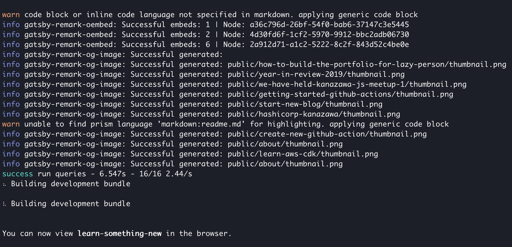

QiitaやDev.toなどのブログサービスでは記事タイトルと著者情報をベースに、SNSにシェアされる際に展開されるOGP画像を自動的に生成してくれます。本記事ではGatsbyJS製のブログで同じ機能の実装にチャレンジしたので、その模様を紹介したいと思います。

`oembed: https://twitter.com/_kentaro_m/status/1226199403498618880`

## OGP画像の生成方法
OGP画像の動的生成は大きく3つの方法で実現できます。

- 画像配信CDNで画像を加工する
  - CDNが提供する画像へのテキスト追加機能を利用する
  - imgixやCloudinaryで実現可能
- サーバーサイドで画像を生成する
  - サーバーサイドで画像処理を行う仕組みを準備する
  - Node.jsではnode-canvasで実現可能
- クライアントで画像を生成する
  - DOMから画像を生成する仕組みを利用する
  - HTMLやCSSで作ったDOMをキャプチャーする

## OGP画像生成ライブラリの作成
GatsbyJSのビルド時に画像生成を実現したかったので、今回はサーバーサイドで処理を行う方法を採用しました。

そして、[catchy-image](https://github.com/kentaro-m/catchy-image)という画像生成を行うNode.jsライブラリを作成しました。フォントや背景色などの画像のスタイルや記事タイトルや著者名などの情報を引数で渡して実行すると、画像生成を行います。類似の機能を持つライブラリはいくつか見つけたのですが、日本語が綺麗に表示できるものがなかったので、今回作成に至りました。

ライブラリの使用例は下記のとおりです。

```js
// ライブラリ使用のサンプルコード

const catchy = require('catchy-image')

async function run() {

    // 画像生成のオプションを指定
    const options = {
      output: {
        directory: '',
        fileName: 'thumbnail.png',
      },
      image: {
        width: 1200,
        height: 630,
        backgroundColor: '#222639',
      },
      style: {
        title: {
          fontFamily: 'Noto Sans CJK JP',
          fontColor: '#bb99ff',
          fontWeight: 'bold',
          fontSize: 64,
          paddingTop: 100,
          paddingBottom: 200,
          paddingLeft: 150,
          paddingRight: 150,
        },
        author: {
          fontFamily: 'Noto Sans CJK JP',
          fontColor: '#f0f5fa',
          fontWeight: '400',
          fontSize: 42,
        },
      },
      meta: {
        title: 'How to dynamically create  an Open Graph image.',
        author: 'Kentaro Matsushita',
      },
      fontFile: [
        {
          path: require.resolve('./fonts/NotoSansCJKjp-Bold.otf'),
          family: 'Noto Sans CJK JP',
          weight: 'bold',
        },
        {
          path: require.resolve('./fonts/NotoSansCJKjp-Regular.otf'),
          family: 'Noto Sans CJK JP',
          weight: '400',
        },
      ],
      iconFile: require.resolve('./images/avatar.jpeg'),
      timeout: 10000,
    }

    // 画像生成の実行
    // 戻り値には生成した画像のパスが含まれる
    const output = await catchy.generate(options)
    console.log(`Successfully generated: ${output}`)
  } catch (error) {
    console.error(error)
  }
}

run()
```

ライブラリで生成される画像は下記のとおりです。記事タイトルと著者名、アイコンを含めることが可能です。


背景色や背景画像の変更、任意のフォント指定などスタイルのカスタマイズもある程度できるようになっています。


画像生成処理は[node-canvas](https://github.com/Automattic/node-canvas)というサーバーサイドのNode.jsでCanvas APIを操作するライブラリを駆使して実現しています。詳細な処理フローや実装のハマりポイントは先日のKanazawa.js meetup #1で発表したので、下記の資料を参照ください。

<Slide id='b81766906fec4f229e905d300e96e53b' />

## GatsbyJSプラグインの作成
ブログの記事情報からOGP画像を生成するために専用のGatsbyJSプラグインを作成しました。

GatsbyJSでは[gatsby-transformer-remark](https://www.gatsbyjs.org/packages/gatsby-transformer-remark/)プラグインがマークダウンをパースして、HTMLファイルに変換しています。変換処理中に得られるマークダウンのパース結果を使用し、記事のタイトルやスラッグなどのメタデータを、画像生成ライブラリの引数に渡して、画像を生成します。

画像は公開ディレクトリである`public/[slug]`に出力されるので、GatsbyJSのビルド処理後に、自動的に公開されます。

[Remark Plugin Tutorial | GatsbyJS](https://www.gatsbyjs.org/docs/remark-plugin-tutorial/)

```js
// plugins/gatsby-remark-og-image/index.js

const catchy = require('catchy-image')

module.exports = async ({ markdownNode }, pluginOptions) => {
  
  // gatsby-config.jsの設定情報とマークダウンのメタデータを画像生成ライブラリの引数に渡す
  const result = await catchy.generate({
    ...pluginOptions,
    output: {
      ...pluginOptions.output,
      directory: `./public${markdownNode.fields.slug}`,
      fileName: pluginOptions.output.fileName,
    },
    meta: {
      ...pluginOptions.meta,
      title: markdownNode.frontmatter.title
    }
  })

  console.info(`gatsby-remark-og-image: Successful generated: ${result}`)
}
```

ブログリポジトリの`plugins`ディレクトリにプラグインに必要なファイル (`package.json`とエントリーポイントとなるJSファイル) を配置すると、プラグインをnpmに公開せずとも、ブログに組み込むことが可能です。今回は`gatsby-remark-og-image`という名前のプラグインを作りました。

```bash
.
├── LICENSE
├── README.md
├── content
├── gatsby-browser.js
├── gatsby-config.js
├── gatsby-node.js
├── node_modules
├── package-lock.json
├── package.json
├── plugins
    └── gatsby-remark-og-image # 作成したGatsbyJSプラグイン
        ├── index.js # エントリーポイント
        └── package.json
├── public
├── src
├── static
└── tsconfig.json
```

プラグインを使用するときは、`gatsby-config.js`に設定を記載します。

```js
// gatsby-config.js

module.exports = {
  plugins: [
    {
      resolve: `gatsby-transformer-remark`,
      options: {
        plugins: [
          {
            resolve: `gatsby-remark-og-image`,
            options: {
              output: {
                directory: '',
                fileName: 'thumbnail.png'
              },
              image: {
                width: 1200,
                height: 630,
                backgroundColor: '#15202B',
              },
              style: {
                title: {
                  fontFamily: 'Noto Sans CJK JP',
                  fontColor: '#1DA1F2',
                  fontWeight: 'bold',
                  fontSize: 64,
                  paddingTop: 100,
                  paddingBottom: 200,
                  paddingLeft: 150,
                  paddingRight: 150,
                },
                author: {
                  fontFamily: 'Noto Sans CJK JP',
                  fontColor: '#DDDDDD',
                  fontWeight: '400',
                  fontSize: 42,
                }
              },
              meta: {
                title: '',
                author: 'matsuken (@_kentaro_m)'
              },
              fontFile: [
                {
                  path: require.resolve('./src/assets/fonts/NotoSansCJKjp-Bold.otf'),
                  family: 'Noto Sans CJK JP',
                  weight: 'bold',
                },
                {
                  path: require.resolve('./src/assets/fonts/NotoSansCJKjp-Regular.otf'),
                  family: 'Noto Sans CJK JP',
                  weight: '400',
                },
              ],
              iconFile: require.resolve('./content/assets/avatar.jpeg'),
              timeout: 10000,
            },
          },
        ],
      },
    },
  ]
}
```

画像生成が成功したときは以下のように、生成画像のファイルパスがログとして出力されます。



## さいごに
先月から取り組んでいたOGP画像の動的生成が形になったので、記事を公開しました。

チャレンジしてみての感想ですが、Node.jsで画像にテキストを入れる際の座標計算が非常に大変でした。次に同じことやるなら、この方法は選ばないかもしれないです。何はともあれ、SNSに記事をシェアした際の見栄えを良くすることは達成できたので、個人的には満足しています。

参考記事: [Generating Twitter Card Images from Blog Post Titles - Shuhei Kagawa](https://shuheikagawa.com/blog/2019/10/13/generating-twitter-card-images/)

現状は自分のブログ環境でしか動作を確認していないので、安定稼働のために、以下に挙げたものを順次やっていきたいと思います。

- 画像生成処理のテスト追加
- 画像生成処理のTypeScript化
- GatsbyJSプラグインのnpm公開
- 画像生成数増加に伴う負荷検証
- 複数のNode.jsバージョンのサポート
  - 現状はNode.js v12のみ動作確認