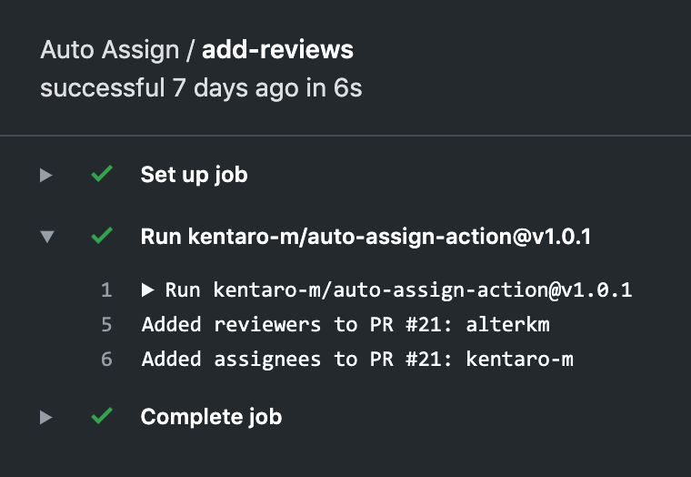

以前よりGitHubのPull Requestにレビュアーをランダムで追加する[Auto Assign](https://github.com/kentaro-m/auto-assign)というGitHub AppをOSSとして公開しているのですが、このたびGitHub Actionsで動作するActionを作ったので紹介したいと思います。

[kentaro-m/auto-assign-action: An action which adds reviewers to the pull request when the pull request is opened.](https://github.com/kentaro-m/auto-assign-action)

## 使い方
リポジトリに`.github/workflows/action.yml`を追加し、GitHub ActionsでActionを実行する設定を作成します。

```yml
# Workflowの名前 (任意の名前でOK)
name: 'Auto Assign'

# どのイベントが発生したときにWorkflowを実行するかを指定
# 今回はPull Requestイベントのときのみ実行
on: pull_request

jobs:
  add-reviews:
    runs-on: ubuntu-latest
    steps:
      - uses: kentaro-m/auto-assign-action@v1.0.1
        with:
          # トークンはリポジトリごとに自動生成される
          # トークンは以下のシーンで使用する
          # - レビュアー追加設定ファイル (auto_assign.yml) の読み込み
          # - Pull Requestにレビュアーを追加する際のAPIコール
          repo-token: "${{ secrets.GITHUB_TOKEN }}"
```

リポジトリに`.github/auto_assign.yml`を追加し、Pull Requestにレビュアーを追加する設定を作成します。設定項目の詳細は[こちら](https://github.com/kentaro-m/auto-assign)から確認可能です。

```yml
# Set to true to add reviewers to pull requests
addReviewers: true

# Set to true to add assignees to pull requests
addAssignees: false

# A list of reviewers to be added to pull requests (GitHub user name)
reviewers:
  - reviewerA
  - reviewerB
  - reviewerC

# A number of reviewers added to the pull request
# Set 0 to add all the reviewers (default: 0)
numberOfReviewers: 0

# A list of assignees, overrides reviewers if set
# assignees:
#   - assigneeA

# A number of assignees to add to the pull request
# Set to 0 to add all of the assignees.
# Uses numberOfReviewers if unset.
# numberOfAssignees: 2

# A list of keywords to be skipped the process that add reviewers if pull requests include it
# skipKeywords:
#   - wip
```

これでActionを使用するための準備は完了です。Pull Requestを作成すれば、設定ファイルに従い、レビュアーが追加されるはずです。

Actionsの実行結果ページでどのPull Requestに誰がレビュアーとして追加されたかを確認できます。



## 作り方
今回はGitHub Actions Toolkitというパッケージを使用して、Actionを作りました。これはJavaScriptでActionを作るときの開発支援ツールで、GitHub APIのコールやSecretsへのアクセス、ロギングなどの処理を簡潔に実装することが可能です。

* [actions/toolkit: The GitHub ToolKit for developing GitHub Actions.](https://github.com/actions/toolkit)

Toolkitを使用してActionを開発するためのテンプレートが公開されているので、Actionの開発に興味がある方は一度確認してみるとよいと思います。

* [actions/javascript-action: Create a JavaScript Action with tests, linting, workflow, publishing, and versioning](https://github.com/actions/javascript-action)
* [actions/typescript-action](https://github.com/actions/typescript-action)
* [Creating a JavaScript action - GitHub Help](https://help.github.com/en/articles/creating-a-javascript-action)

ここからはActionを実際に作って動作させるために行った作業を紹介します。

### Action設定ファイル作成
リポジトリのルートに`action.yml`を追加し、Actionの設定を作成します。ここではActionをGitHub Marketplaceに公開する際の情報や動作環境、環境変数を設定することが可能です。

`action.yml`で指定できる情報はGitHubの[ドキュメント](https://help.github.com/en/articles/metadata-syntax-for-github-actions)をご覧ください。

```yml
# Action名
# GitHub Marketplaceで公開する際の名前
name: 'Auto Assign Action'
# Actionの説明
description: 'Add reviewers to pull requests when pull requests are opened.'
# Actionの作成者
author: 'Kentaro Matsushita'

# Action実行時に外部から渡すデータ
inputs:
  repo-token:
    description: 'A token for the repo'
    required: true
  configuration-path:
    description: 'A path for the auto-assign configuration'
    default: '.github/auto_assign.yml'

runs:
  # 実行環境
  using: 'node12'
  # Actionのエントリーポイント
  main: 'dist/index.js'

# GitHub Marketplaceで公開する際のアイコン
branding:
  icon: 'user-plus'
  color: 'blue'
```

Action内部ではPull Requestにレビュアーを追加するまでに以下の処理が行われています。

1. レビュアー追加設定ファイル (`.github/auto_assign.yml`) の取得
2. Payloadの取得
3. レビュアー追加

### レビュアー追加設定ファイルの取得
レビュアー追加設定ファイルは冒頭で紹介した `.github/auto_assign.yml` のことです。Action内部ではYAML形式の設定ファイルをObjectとして扱っています。

```yaml
# Set to true to add reviewers to pull requests
addReviewers: true

# Set to true to add assignees to pull requests
addAssignees: false

# A list of reviewers to be added to pull requests (GitHub user name)
reviewers:
  - reviewerA
  - reviewerB

# A number of reviewers added to the pull request
# Set 0 to add all the reviewers (default: 0)
numberOfReviewers: 0

# A list of keywords to be skipped the process that add reviewers if pull requests include it
skipKeywords:
  - wip
```

```javascript
// YAML形式の設定ファイルは最終的にObjectに変換される
{
  addAssignees: false,
  addReviewers: true,
  numberOfReviewers: 0,
  reviewers: ['reviewerA', 'reviewerB'],
  skipKeywords: ['wip'],
}
```

設定ファイルを取得して、GitHub Actionsのビルド結果に出力するサンプルコードを作ってみました。

`@actions/core`パッケージの`getInput`メソッドを使用すると、Workflowファイルで設定したinputパラメータの値が取得できます。今回はGitHubトークンとレビュアー追加設定ファイルのパスをinputパラメータとして指定しており、これらの値を用いて、[Repository Contents API](https://developer.github.com/v3/repos/contents/)をコールして、設定ファイルを取得しています。

```typescript
import * as core from '@actions/core'
import * as github from '@actions/github'
import * as yaml from 'js-yaml'

try {
  // inputsパラメーターで指定された値を取得
  // Workflowファイルのjobs.<job_id>.steps.withで指定
  const token = core.getInput('repo-token', { required: true })
  const configPath = core.getInput('configuration-path', {
    required: true,
  })

  const client = new github.GitHub(token)
  const { repo, sha } = github.context

  // Repository Contents APIを実行して、リポジトリ内のレビュアー追加設定ファイルを取得
  const result = await client.repos.getContents({
    owner: repo.owner,
    repo: repo.repo,
    path: configPath,
    ref: sha,
  })

  const data: any = result.data

  if (!data.content) {
    throw new Error('the configuration file is not found')
  }

  // APIから取得したデータをBase64デコードし、文字列に変換
  const configString = Buffer.from(data.content, 'base64').toString()

  // YAMLの文字列をObjectに変換
  const config = yaml.safeLoad(configString)

  // 設定ファイルの内容を出力
  core.info(config)
} catch (error) {
  core.setFailed(error.message)
}
```

### Payloadの取得
ActionはPull Requestイベントをトリガーに動作します。発生したイベントの詳細は以下のようにPayloadに記録されます。

Payloadに含まれる情報の詳細は[こちら](https://developer.github.com/v3/activity/events/types/)をご覧ください。

```js
{
  eventName: 'pull_request',
  workflow: 'Auto Assign',
  action: 'auto-assign-action',
  actor: 'kentaro-m',
  payload: {
    action: 'opened',
    number: '1',
    pull_request: {
      number: 1,
      title: 'test',
      user: {
        login: 'pr-creator',
      },
    },
    repository: {
      name: 'auto-assign',
      owner: {
        login: 'kentaro-m',
      },
    },
  },
  repo: {
    owner: 'kentaro-m',
    repo: 'auto-assign',
  },
  issue: {
    owner: 'kentaro-m',
    repo: 'auto-assign',
    number: 1,
  },
  sha: '',
  ref: '',
}
```

Payloadは`@actions/github`パッケージを使用して取得可能です。ビルドが発生したPull RequestのPayloadを利用して、GitHub APIをコールし、GitHub上の様々な操作の自動化を実現します。

```typescript
import * as core from '@actions/core'
import * as github from '@actions/github'

try {
  // Payloadの内容を出力
  core.info(github.context.payload)
} catch (error) {
  core.setFailed(error.message)
}
```

### レビュアーの追加
レビュアーの追加は`@actions/github`パッケージでGitHub APIをコールして行います。

```typescript
import * as core from '@actions/core'
import * as github from '@actions/github'

try {
  const token = core.getInput('repo-token', { required: true })
  const client = new github.GitHub(token)

  const { owner, repo, number: pull_number } = github.context.issue
  const reviewers = [ 'reviewerA', 'reviewerB' ]

  const result = await this.client.pulls.createReviewRequest({
    owner,
    repo,
    pull_number,
    reviewers,
  })

  // API実行結果を出力
  core.debug(JSON.stringify(result))
} catch (error) {
  core.setFailed(error.message)
}
```

### ビルド
JavaScriptで作ったActionを公開する場合はリポジトリに依存関係をすべて含める必要があります。これはWorkflow上でActionが実行される際はコードをダウンロードして、依存パッケージのインストールやビルドなしにすぐに実行されるためです。

この制約に対応するために以下の2種類のビルド方法が利用できます。私は後者を採用しました。

* TypeScriptコードをビルドして生成されたJavaScriptファイルと`node_modules`をリモートリポジトリにPushする
* Zeitが提供する`ncc`コマンドでビルドし、依存関係を含めた単一のJavaScriptファイルをリモートリポジトリにPushする

```bash
# 依存パッケージを削除
$ rm -rf node_modules

# Production向けに依存パッケージをインストール
$ npm install --production

# TypeScriptファイルをビルド
$ tsc

# nccをインストール
$ npm i -g @zeit/ncc

# 単一ファイルにまとめる
$ ncc build lib/main.js
```

### GitHub Marketplaceに公開する
Actionが完成したら、GitHub Marketplaceに公開しましょう。利用してもらう機会が増えると思います。

リポジトリのReleaseページからGitHub Marketplaceに公開する手続きが可能です。`action.yml`と`README.md`をリポジトリに含める必要があります。`README.md`に含めると良い情報はGitHubの[ページ](https://help.github.com/en/articles/creating-a-javascript-action#create-a-readme)にまとまっています。


ビルドで生成したファイルをリモートリポジトリのmasterブランチにコミットし、セマンティックバージョニングのルールでGitタグを切ります。下部のPublish releaseボタンを押すと、公開されます。


リリース成功！


## 雑感

### 処理が失敗したときに原因を突き止めやすい
GitHub Appではログを閲覧できるのは、アプリをホスティングしている管理者のみだったので、ユーザー視点では処理の成功や失敗以上の詳細情報を得ることが難しい状態でした。GitHub Actionsではリポジトリ単位で実行されるため、実行結果は各リポジトリのActionsタブから確認可能となっており、エラーメッセージから処理失敗の確認がしやすいのではないかと感じました。

### Organizationレベルの操作はできない
GitHub AppではOrganization単位でアプリをインストールすることができ、Organization配下の全リポジトリでアプリを利用することが簡単にできました。GitHub Actionsでは現状Organizationレベルでリポジトリの操作はできないようでした。

### デバッグのベストプラクティスがわからない
HCL形式のGitHub ActionsではローカルでActionを実行するCLIツールがありました。現状、YAML形式のActionではそのような便利ツールは見当たりません。

[nektos/act: Run your GitHub Actions locally](https://github.com/nektos/act)

今回のデバッグはテスト用リポジトリを作成し、Workflowでは開発中のブランチを指定し、ひたすらPull Requestを作成してテストを繰り返すような骨の折れる作業でした。このあたりが改善してくると、Actionの開発がよりやりやすくなると思いました。

```yml
name: 'Auto Assign'

on: pull_request

jobs:
  add-reviews:
    runs-on: ubuntu-latest
    steps:
      # 任意のブランチを指定
      - uses: kentaro-m/auto-assign-action@topic-branch
        with:
          repo-token: "${{ secrets.GITHUB_TOKEN }}"
```

### Probotとの棲み分けはどうなるのか
GitHub Actions Toolkitを使用することで、Probotで実装されている[GitHub App](https://probot.github.io/apps/)の機能はGitHub Actionsに移植できると思います。Organizationレベルの操作の可否など微妙な違いはありそうですが、同じような処理ができるようになったので、Probotの今後が個人的に気になっています。

## さいごに
アイデア次第でGitHub上の様々な作業を自動化できるので、今後も様々なActionが増えていきそうです。みなさんも自作Actionで作業効率化にチャレンジしてみてください。