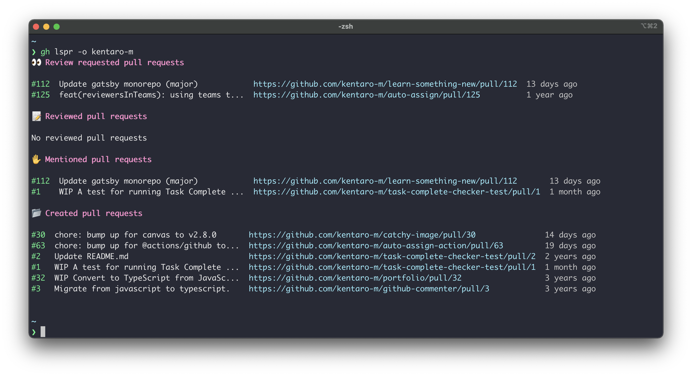

自分が関係しているGitHubのPull Requestを一覧表示するGitHub CLI extensionを作りました。本記事ではその紹介をしたいと思います。

[kentaro-m/gh-lspr: gh-lspr is GitHub CLI extension to help you to check pull requests to which you need to respond.](https://github.com/kentaro-m/gh-lspr)

ちなみにGitHub CLI extensionはGitHubをコマンドラインから操作するためのCLIである `gh` コマンドにサブコマンドを生やして機能拡張できるものです。GitHub CLIのバージョン2から同機能のサポートを開始しました。

[GitHub CLI 2.0 includes extensions! | The GitHub Blog](https://github.blog/2021-08-24-github-cli-2-0-includes-extensions/)

## 作ったもの
自分が関係しているPull Requestの情報 (番号やタイトル、URL、更新日) をコマンドラインに一覧表示してくれます。

私が使っているコマンドラインツールのiTerm2では、`Command`　キーを押しながら、 URLをクリックすると、ブラウザを開く機能があるので、それを使って該当のPull Requestを見に行くという使い方をしています。



表示するPull Requestはオープンでしているものかつ以下の4つの条件に合致するものを設定しています。

- 自分がオープンしたPull Request
- 自分がレビューしたPull Request
- 自分宛てにメンションがきているPull Request
- 自分宛てにレビューリクエストがきているPull Request

GitHubでは `involves` という検索オプションを提供しており、自分が関係しているIssueやPull Requestを検索できますが、こちらを参考にしつつ、自分のユースケースに合うようにカスタマイズしています。 

[Search by a user that's involved in an issue or pull request - GitHub Docs](https://docs.github.com/en/search-github/searching-on-github/searching-issues-and-pull-requests#search-by-a-user-thats-involved-in-an-issue-or-pull-request)


## 使い方
`gh` コマンドをインストール後に、下記の手順でExtensionのインストールと実行が可能です。

```shell
# インストール
$ gh extension install kentaro-m/gh-lspr 

# 実行
$ gh lspr
```

`-o` オプションを指定すると、ユーザーやオーガニゼーション単位でPull Requestの表示を絞ることができます。

```shell
# Organization or Userを指定
$ gh lspr -o kentaro-m
```

他にも色々とオプションを用意しています。

```shell
gh lspr -h
This extension helps you to check pull requests which you need to respond.

USAGE
  $ gh lspr [flags]

FLAGS
  -rr, --review-requested   Filter by review requested to others
  -r, --reviewed            Filter by reviewed by me
  -c, --created             Filter by created by myself
  -m, --mentioned           Filter by mentioned to me
  -o, --org                 Filter by organization name or user name
  -l, --limit               Maximum number of items to fetch (default 10)
  -h, --help                Show help

EXAMPLES
  $ gh lspr
  $ gh lspr -l 20
  $ gh lspr -r
  $ gh lspr -c
  $ gh lspr -m -l 15
```

## モチベーション
自分のアクションが必要なPull Requestをサクッと確認する手段が欲しかったという点が、今回Extensionを作ったモチベーションになります。

その上で特に達成したかったことが以下の2点になります。

### 自分が関係しているPull Requestをまとめてみたい
最近の業務では複数リポジトリを横断して、Pull Requestの作成やレビューを行う機会があります。そのため、複数リポジトリに存在するPull Requestの状況を追いかけて、任意のタイミングで対応が必要です。

現在ではPull Requestの状況はSlack通知やGitHub通知ページ、メールなど様々な手段で得ているものの、自分に関係がない情報も混ざっていたりして、確認したい情報にたどり着くまでに時間がかかることがありました (通知設定がうまくできてない側面もある)。

自分のアクションが必要なPull Requestをまとめて表示すれば、抱えている課題を解決できるのではないかと思いました。

### ブラウザにアクセスすることなくPull Reuqestの状況を知りたい
GitHubをブラウザで開いているときは、自分のPull Requestの作成やチームメンバーのPull Requestのレビューなど目的があって開いています。逆に言うと、用事がないときは開かなくてよいのが理想です。

コマンドラインでExtensionを実行して、とりあえず自分のアクションが必要なPull Requestがあるという状況をつかめれば、自分の作業を考慮しつつ、レビューするタイミングの計画が頭の中で立てられ、コンテキストスイッチのオーバーヘッドを減らせると考えました。

## 実装面
`gh api` コマンドでGitHubの検索APIを実行して、検索条件に合致したPull Requestの一覧を取得しています。今回はシェルスクリプトで実装しており、具体的な処理内容は以下のとおりです。

1. フラグのパース ( `-owner` や `--limit` など)
2. 検索APIのパラメータ組み立て (GraphQLクエリの組み立て)
3. 検索API実行 (GraphQLクエリの実行)
4. コマンドライン出力フォーマットの整形 (Goの `template` 機能を利用)

```bash
# 自分宛てにレビューリクエストがきているPull Requestを取得するための検索クエリ
requested_prs_query='is:open is:pr review-requested:@me'

show_filtered_pr_list() {
  # Pull Request一覧を取得するための　GraphQLのクエリを定義
  local query='
  query ($q: String!, $limit: Int = 10) {
    search(first: $limit, type: ISSUE, query: $q) {
      nodes {
        ... on PullRequest {
          number
          title
          url
          updatedAt
          repository {
            name
          }
        }
      }
    }
  }
  '

  # Goのテンプレート機能を用いて、コマンドラインへの出力フォーマットを定義
  local template='
{{- range $pr := .data.search.nodes -}}
  {{- tablerow (printf "#%v" .number | autocolor "green") (truncate 40 .title) (.url | autocolor "cyan") (.updatedAt | timeago | autocolor "white")  -}}
{{- end -}}
{{ if eq (len .data.search.nodes) 0 }}
{{- printf "No pull requests match your filter" -}}
{{ else }}
{{- tablerender -}}
{{ end }}
'

  # GitHub CLIからGraphQLのクエリを実行し、定義したテンプレートの出力を得る
  gh api graphql -F q="$1" -F limit="$limit" -f query="$query" --template="$template"
}

show_filtered_pr_list "$requested_prs_query"
```

### Goの `template` でAPI実行結果をフォーマットして表示

結構便利だなと感じたのは、API実行結果をGoの `template` 機能でフォーマットするオプション `--template` です。

Pull Requestの一覧をテーブル形式で表示するときに役立ちました。時間を相対時間で表示する関数 `timeago` や文字列を省略する関数 `truncate`、文字列を色付けする関数 `color` などを活用して、シェルスクリプトで頑張らずとも期待する見た目を実現できました。

ただし、API実行結果をこのオプションでフォーマットしてしまうと、パイプラインで他のプログラムに結果を渡して、処理を行うことが難しくなります。API実行結果の他のプログラムでの活用を考えている場合は `--jq` オプションでJSONとして渡してあげるのが良さそうです。

[gh formatting | GitHub CLI](https://cli.github.com/manual/gh_help_formatting)

### シェルスクリプト or GoのどちらでExtensionを作るか
私はGoを書いた経験があまりないので、シェルスクリプトでExtensionを作りました。

複雑な処理を要したり、何らかのパッケージに依存したりするExtensionを作る場合はGo等で作って、バイナリを配布する形で作ったほうが良いと感じました。

今回は実装しなかったのですが、`fzf` を組み合わせて、インクリメンタルサーチをして、任意のPull Requestをブラウザで表示するというアイデアがありました。シェルスクリプトで作った場合は `fzf` のインストールが動作の前提になってしまうので断念しました。

[Creating GitHub CLI extensions - GitHub Docs](https://docs.github.com/en/github-cli/github-cli/creating-github-cli-extensions)

## さいごに
1ヶ月くらい自作のExtensionを使ってみて、出勤したタイミングや作業が空いたタイミングでコマンドを実行して、Pull Requestを確認してレビューするというルーティンが定着してきました。200行あまりの小さなプログラムですが、抱えている課題を解決することができて、満足しています。

自分のアイデア次第でGitHubのコマンドライン操作をより便利に効率的にすることが可能です。ぜひ皆さんもExtension作りに挑戦してみてください。GitHubの `gh-extension` というトピックで様々な開発者が公開しているExtensionが確認できます。

[gh-extension · GitHub Topics](https://github.com/topics/gh-extension)

P.S. 最近Twitterでより多機能でで見た目がかっこいいPull Requestのダッシュボードを表示するExtensionを知りました。まだ試せてないですが、良さそうな感じがしています。

[dlvhdr/gh-prs: gh cli extension to display a dashboard of PRs - configurable with a beautiful UI.](https://github.com/dlvhdr/gh-prs)