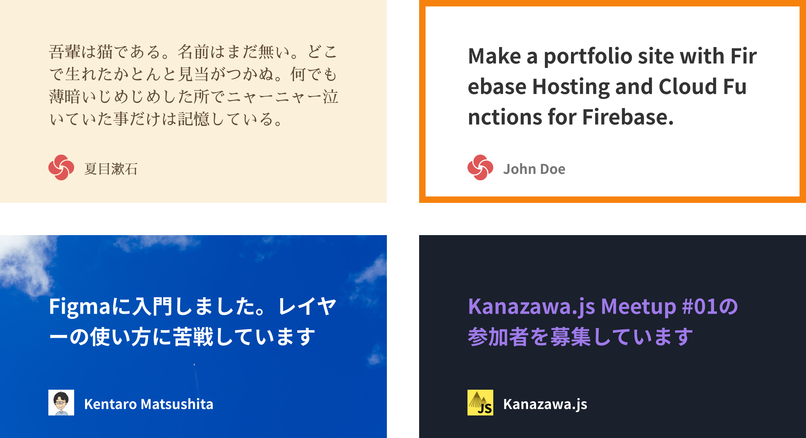
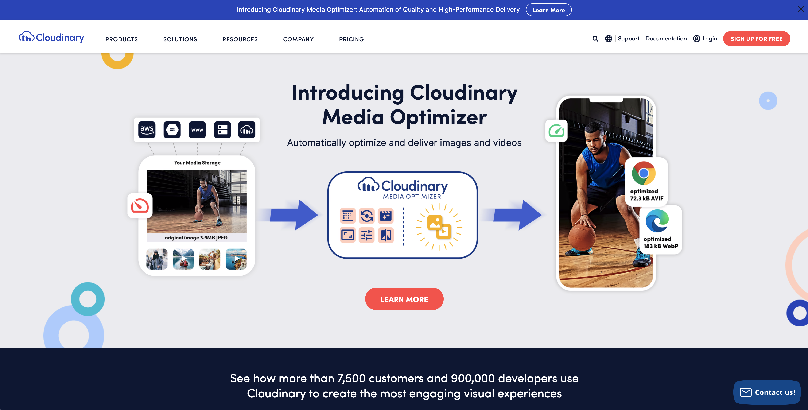
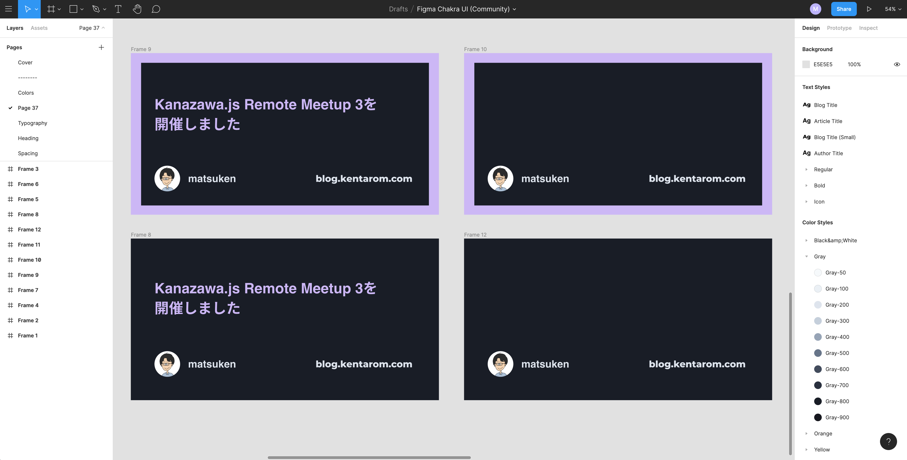
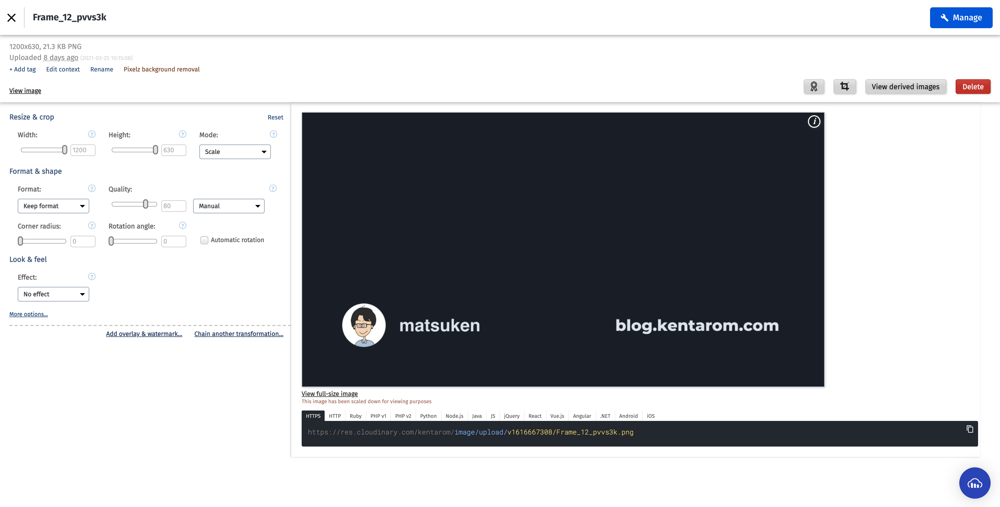
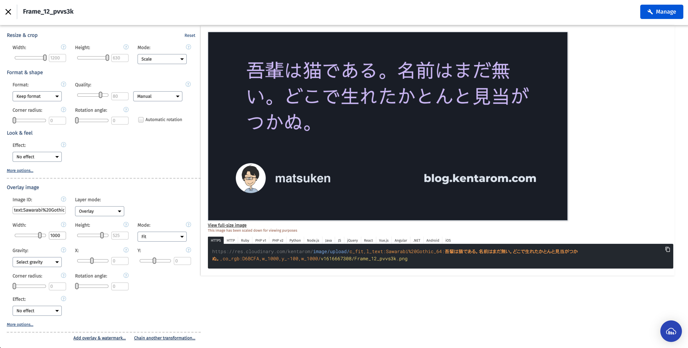
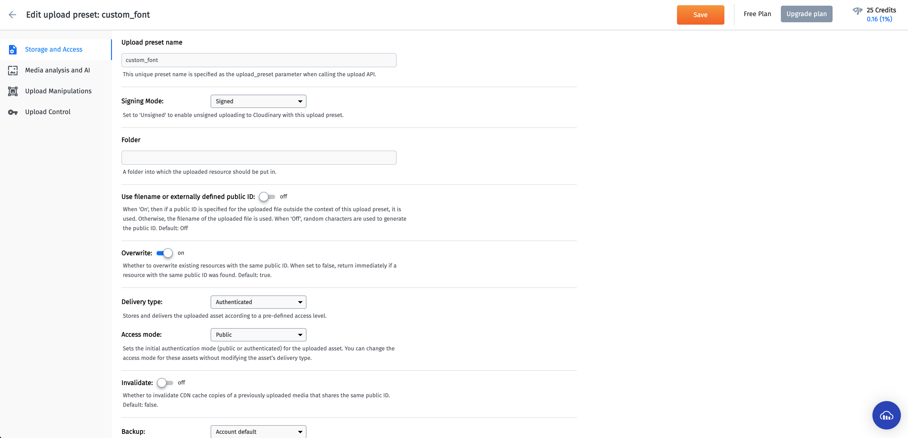
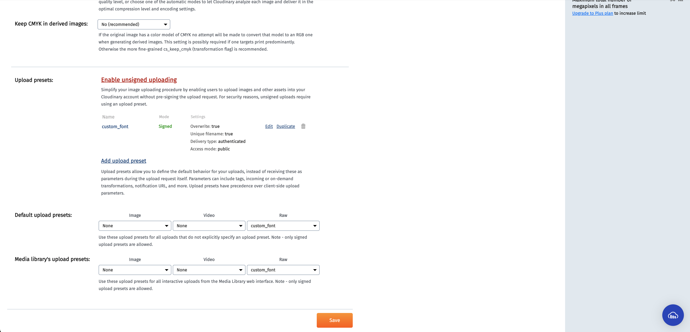
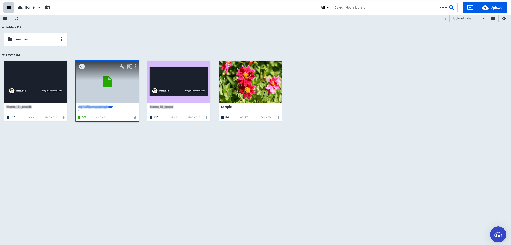

以前に[OGP画像の動的生成](https://blog.kentarom.com/create-gatsbyjs-plugin-to-dynamically-generate-og-images)の記事を書きましたが、より手間を掛けずに素早く画像を作る方法を見つけたので、紹介したいと思います。

## OGP画像生成の歩み
これまでは[node-canvas](https://github.com/Automattic/node-canvas)を利用して、準備した背景画像内に記事タイトルをテキストとして描画して、画像を生成していました。



この方法は以下の課題を抱えていました。

- テキスト描画調整の難易度が高い
  - テキストの描画位置は座標指定のため、細部の調整が難しい
  - 行折返しは独自の計算ロジックがあり、コードの保守コストが高い
- ブログのビルド速度が遅い
  - ビルドタイミングで画像生成を行うため、ビルド速度が低下する

今回、[Cloudinary](https://cloudinary.com/)という画像管理サービスを利用することで、これらの課題を解決することができました。

## Cloudinaryとは


### 機能
画像やビデオの最適化配信が強みの画像・ビデオ管理のサービスです。今回のOGP画像生成に関連する機能としては以下の特徴があります。

#### 画像の最適化配信

エンドユーザーのデバイスやブラウザ、インターネット接続速度に応じて、画像やビデオを最適化して配信することが可能。
1つのJPEG画像から異なるフォーマット (AVIFやWebPなど) や品質、サイズの画像を自動生成します。

#### 画像の動的変換

画像のトリミングやサイズ変更、フィルタリング、テキスト追加などを動的に行えます。

### 料金
使用量に応じて、FREE、PLUS、ADVANCEDの3つの料金プランを選択して、登録する形式となっています。

[Cloudinary - Pricing and Plans](https://cloudinary.com/pricing)

## OGP画像生成のやり方

### 背景画像のデザイン
記事タイトルのテキストを追加する対象の背景画像を最初に準備しました。FigmaでOGP画像の推奨サイズである幅1200px × 高さ630pxで作ります。

左側が最終的に生成されるOGP画像デザインで、右側がCloudinaryで使用する背景画像です。



### 画像へのテキスト追加
画像へのテキスト追加はテキストオーバーレイ機能を利用します。



画像編集画面の下部の `Add overlay & watermark...`というリンクを押下すると、`Overlay image`という設定項目が追加で表示されます。

この設定項目に値を追加すると、画像のプレビュー表示とURL表示が更新されます。自分の好みのテキスト追加が実現できるまで、繰り返し設定値を調整します。

生成されるURLは、OGPタグ追加で必要なので、メモしておくと良いと思います。



ここで本サイトのOGP画像生成で変更した設定項目を紹介します。

#### テキスト追加とフォントスタイル変更
- `Image ID`をフォーマットに沿って更新する

フォントスタイルはフォントファミリーやフォントサイズ、フォントカラーの変更をサポートしています。

```
text:フォントファミリー_フォントサイズ:任意のテキスト,co_rgb:フォントカラー(16進数カラーコード)
```

本サイトの設定値は下記の通りです。
```
text:Sawarabi%20Gothic_64:吾輩は猫である。名前はまだない。どこで生れたか頓と見当がつかぬ。,co_rgb:D6BCFA
```

#### テキストの幅と高さ (描画領域)
- `Width` と `Height`に任意の値を追加する
- 本サイトの設定値: `Width`を`1000`に設定

#### テキストの描画位置
-  `X` と `Y` に任意の値を追加する
- 本サイトの設定値: `Y`を`-100`に設定

#### テキストの行折返し
- 本サイトでは`Mode`を`Fit`に設定

テキストが指定幅を超えるときに自動的に折返ししてくれます。
                                                                                                     

### カスタムフォントの導入
Cloudinaryのテキストオーバーレイ機能ではGoogle Fontのサポートが謳われていますが、日本語のフォントでは `Sawarabi Gothic`と`Sawarabi Mincho`のみが動作可能なようです。

[CloudinaryがテキストオーバーレイでサポートしているGoogle Fontを調べてみた](https://qiita.com/kanaxx/items/6a03a7c7ca158ca00935)

本サイトでは`Noto Sans JP`を利用したかったので、Cloudinaryへのカスタムフォントの導入に取り組みました。

公式ドキュメントを参考にしながら、下記の3ステップを行いました。

1. Upload Presetsの設定追加
2. Upload Presetsの有効化
3. フォントファイルのアップロード

#### 1. Upload Presetsの設定追加
`Settings`ページ > `Upload`タブと進み、`Add upload preset`を押下すると、下記の画面が表示されます。

下記の設定値を追加し、設定を保存します。

- `Upload preset name`: 任意の名前
- `Signing mode`: `Signed`
- `Delivery type`: `Autheticated`



#### 2. Upload Presetsの有効化
`Default upload presets`と`Media library's upload presets`の`Raw`を1で作ったPresetを指定して、設定を保存します。



#### 3. フォントファイルのアップロード
カスタムフォントは`.ttf`、`otf`、`woff2`の形式をサポートしています。なお、カスタムフォント利用の際は対象のフォントのライセンスを事前に確認しましょう。

Media Libraryのページに移動し、フォントファイルをドラッグ&ドロップして、アップロードできます。さきほど設定したプリセットが利用されます。



アップロードされたファイル名をフォントファミリーに指定すると、カスタムフォントが利用可能になります。

```
text:hoge.otf_64:吾輩は猫である。名前はまだない。どこで生れたか頓と見当がつかぬ。,co_rgb:D6BCFA
```

### OGPタグの設定
Cloudinaryで生成したOGP画像の利用は、OGPタグに画像編集画面で生成したURLを追加するだけで設定完了です。
```html
<!-- OGPタグの設定 -->
<meta property="og:image" content="https://res.cloudinary.com/johndoe/image/upload/c_fit,l_text:Sawarabi%20Gothic_64:吾輩は猫である,co_rgb:D6BCFA,w_1000,y_-100/v1616667308/upload_image_name.png">

<!-- Twitter Cardの設定 -->
<meta name="twitter:card" content="summary_large_image">
<meta name="twitter:image" content="https://res.cloudinary.com/johndoe/image/upload/c_fit,l_text:Sawarabi%20Gothic_64:吾輩は猫である,co_rgb:D6BCFA,w_1000,y_-100/v1616667308/upload_image_name.png">

```

本サイトの導入では追加するテキストを `encodeURIComponent` でエンコードしています。

```typescript
const title = '吾輩は猫である'
const imageURL = 'https://res.cloudinary.com/johndoe/image/upload/c_fit,l_text:Sawarabi%20Gothic_64:${encodeURIComponent(title)},co_rgb:D6BCFA,w_1000,y_-100/v1616667308/upload_image_name.png'
```

Twitterではこのように表示されます。

<Tweet tweetLink='https://twitter.com/_kentaro_m/status/1375050635389771783' />

## さいごに
OGP画像生成をNode.jsのパッケージ (`node-canvas`) から画像管理SaaS (Cloudinary) に切り替えたことで、導入コストや運用コストを大幅に下げることができました。

個人ブログ規模のアクセスであれば、CloudinaryのFreeプランで十分運用できそうです。興味がある方はぜひお試しください。
