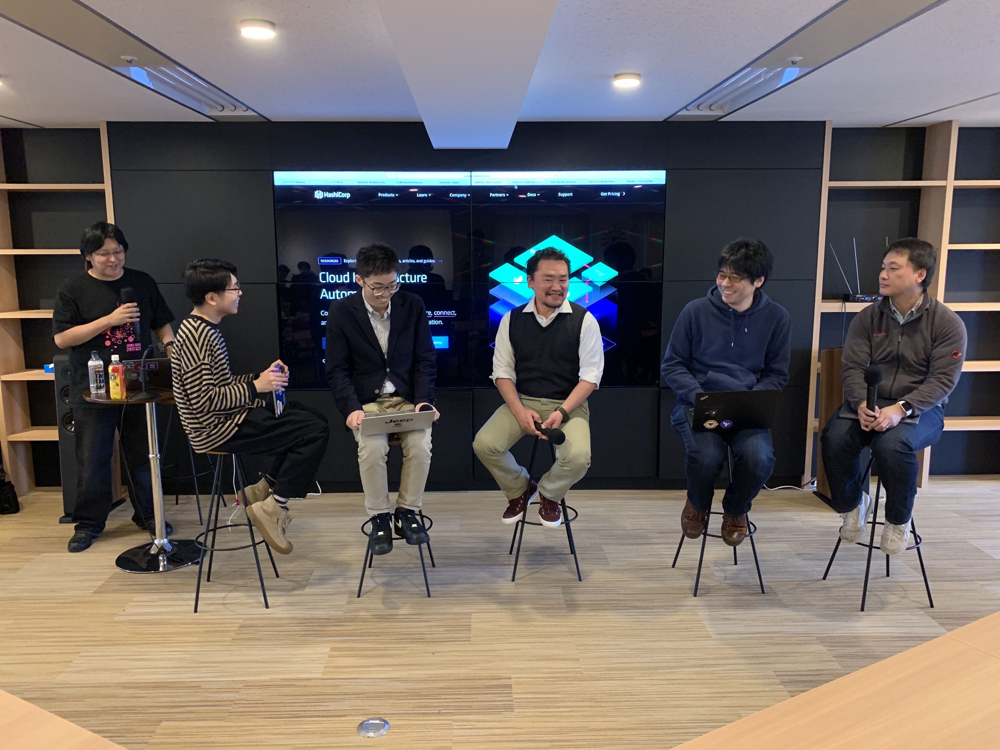

[HashiCorp Terraform & Vault Enterprise 勉強会 in 金沢](https://connpass.com/event/120462/)に参加してきました。当日にツイートした内容をもとにレポートをまとめました。

## HashiCorp製品の説明 / HashiCorp 伊藤さん
HashiCorpの伊藤さんからHashiCorpの製品について説明がありました。HashiCorpでは4つのミッション（Provison、Secure、Connect、Run）を掲げており、それらを実現するために4つの製品（Terraform、Vault、Consul、Nomad）を展開しているそうです。

### Terraform
Terraformはインフラをコードで管理するツール。ユースケースはIaC、マルチクラウドの管理、セルフサービスのプロビジョニングを想定している。Enterprise版はSaaSとして提供しており、実行ログやステートの管理、Policy as Codeなどの機能によって、複数人の共同作業におけるガバナンスを効かせることができる。

### Vault
Vaultはシークレット管理や暗号化を行うツール。パスワードやAPIキーなどのシークレットの安全な保管やローテション、API経由のアクセスを提供している。また、AWSやGCPなどのリソースに一時的にアクセスする動的な認証情報を生成することができる。

## HashiCorp製品の活用事例
HashiCorp製品を使用している開発者から活用事例の発表がありました。スライドが公開されているものをまとめました。

### 私がTerraformを使うポイント / @muryoimplさん
インフラ構築専門ではない開発者の立場からTerraformを選んだポイントと使うときに意識しているポイントを紹介されていました。

発表資料: [私がTerraformを使うポイント/The point I use Terraform - Speaker Deck](https://speakerdeck.com/muryoimpl/the-point-i-use-terraform)

### Vaultの活用による セキュアなパスワード管理 / @inokzyさん
オンプレサーバー上でパスワードをセキュアに管理するためにVaultをどのように活用しているのかを紹介されていました。Vaultクライアントを利用することで、パスワードの取得・置換を簡単にデプロイフローに組み込むことができるとのこと。

発表資料: [Vaultの活用による セキュアなパスワード管理 / vault-secure-password - Speaker Deck](https://speakerdeck.com/inokzy/vault-secure-password)

### Orbsから始めるTerraform生活 / @mafuyukさん
Terraformで毎回同じようなCI/CDパイプラインを構築した経験から、同様のパイプラインを素早く構築できるようにCircle CI Orbsでパッケージ化に挑戦したことを紹介されていました。

発表資料: [Orbsから始めるTerraform生活/ terraform-life-starting-from-orbs - Speaker Deck](https://speakerdeck.com/mafuyuk/terraform-life-starting-from-orbs)

## ノベルティ
HashiCorpさんからは製品ステッカー、JAWSUGさんからはクリアファイルをいただきました。ありがとうございました。

<blockquote class="twitter-tweet" data-lang="ja">
ノベルティ増えました <a href="https://twitter.com/hashtag/jawsug?src=hash&amp;ref_src=twsrc%5Etfw">#jawsug</a> <a href="https://twitter.com/hashtag/kzrb?src=hash&amp;ref_src=twsrc%5Etfw">#kzrb</a> <a href="https://t.co/wJAmBoHLmN">pic.twitter.com/wJAmBoHLmN</a>
&mdash; kentarom (@_kentaro_m) <a href="https://twitter.com/_kentaro_m/status/1106783661070778368?ref_src=twsrc%5Etfw">2019年3月16日</a></blockquote>

<blockquote class="twitter-tweet" data-lang="ja">
Hashicorpさんからノベルティをいただきました。<a href="https://twitter.com/hashtag/kzrb?src=hash&amp;ref_src=twsrc%5Etfw">#kzrb</a> <a href="https://twitter.com/hashtag/jawsug?src=hash&amp;ref_src=twsrc%5Etfw">#jawsug</a> <a href="https://t.co/El3OnVVyPQ">pic.twitter.com/El3OnVVyPQ</a>
&mdash; kentarom (@_kentaro_m) <a href="https://twitter.com/_kentaro_m/status/1106774257495756800?ref_src=twsrc%5Etfw">2019年3月16日</a></blockquote>

## さいごに
これまで雰囲気でHashiCorpのツール群に触れていたこともあり、今回の勉強会で様々なユースケースや機能を知り、もっと勉強して使いこなせるようになりたいと思いました。HashiCorpの伊藤さんをはじめ、各コミュニティの主催者、参加者の皆さん、ありがとうございました。
