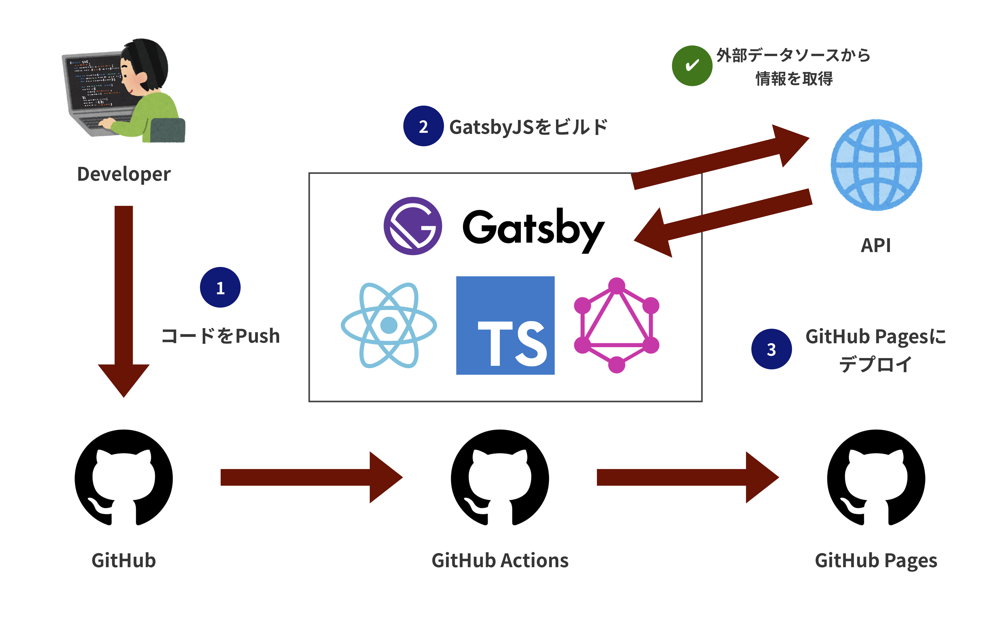

[DMMグループ Advent Calendar 2019](https://qiita.com/advent-calendar/2019/dmm) 8日目の記事です。

こんにちは、[@kentarom](https://twitter.com/_kentaro_m) です。普段はDMM GAMESでゲームプラットフォーム開発プロジェクトのフロントエンドエンジニアとして働いています。本記事では個人のポートフォリオサイト ([kentarom.com](https://kentarom.com/)) のリニューアルに取り組んだ話を紹介したいと思います。

## ポートフォリオサイトをリニューアルしたい欲
昨年10月にNext.jsとFirebaseを使用して、外部活動 (QiitaやOSS開発、外部発表スライドなど) を集約するポートフォリオサイトを作りました。これは当時、バックエンドエンジニアとしての外部活動の成果物が様々な場所に分散している課題の解決策として実施しました。

[Next.jsとFirebaseで更新の手間がかからないポートフォリオサイトを作ってみた - Qiita](https://qiita.com/kentaro_m/items/51ba502fd5b1c603a439)

ポートフォリオサイトでは、外部サイト (GitHub、Qiita、Speaker Deckなど) の情報をAPI経由で取得と表示を行うことで、新たな成果物が生まれても、サイト自体の更新は不要というお手軽さが非常に気に入ってました。

一方でサイトパフォーマンスの低さとデプロイ作業の複雑さの課題がありました。

- サイトパフォーマンスが悪い
  - ページレンダリングのたびに外部サイトのAPIをコールしていることが主な原因
- デプロイ作業が複雑
  - Cloud Functions上でNext.jsを動作させるためにひと手間必要
  - デプロイ関連のnpm-scriptsが肥大化してきて、訳がわからなくなってきた


```json
# 肥大化したnpm-scripts
"scripts": {
  "dev": "next src/app",
  "build": "next build",
  "start": "next start",
  "lint": "eslint src/app/**/*.js",
  "preserve": "yarn build-public && yarn build-funcs && yarn build-app && yarn copy-deps && yarn install-deps",
  "serve": "NODE_ENV=production firebase serve",
  "predeploy": "yarn build-public && yarn build-funcs && yarn build-app && yarn copy-deps",
  "deploy": "firebase deploy",
  "deploy:ci": "firebase deploy --token=\"$FIREBASE_TOKEN\"",
  "set-env": "firebase functions:config:set token.github=\"$GITHUB_API_TOKEN\" token.qiita=\"$QIITA_API_TOKEN\" token.sentry=\"$SENTRY_PUBLIC_DSN\"",
  "copy-deps": "cpx \"*{package.json,yarn.lock}\" \"dist/functions\"",
  "install-deps": "cd \"dist/functions\" && yarn",
  "build-public": "cpx \"src/public/**/*.*\" \"dist/public\" -C && cpx \"src/app/static/**/*.*\" \"dist/public/static\"",
  "build-funcs": "cpx \"src/functions/**/*.*\" \"dist/functions\"",
  "build-app": "NODE_ENV=production next build \"src/app\"",
  "clean": "rimraf \"dist/functions/**\" && rimraf \"dist/public\"",
  "firebase-login": "firebase login"
}
```

これらの課題を解決するために、ポートフォリオサイトのリニューアルを決め、技術選定を行いました。

## 選ばれたのはGatsbyJSでした


更新の手間がかからないという当初のコンセプトを維持しつつ、サイト構築が簡単に行えて、ページパフォーマンスも高いという条件で検討したところ、GatsbyJSを採用することにしました。

(ちょうどこの時期にフロントエンドエンジニアに転身して、プロジェクトでTypeScriptとGraphQLを使用することになり、学習が必要という状況も採用を後押ししました)

ポートフォリオサイトの技術スタックは以下のとおりです。

- フロントエンド
  - Gatsby.js (React)
    - TypeScript
- ホスティング
  - GitHub Pages
- ビルド・デプロイ
  - GitHub Actions



ここからポートフォリオサイト構築のポイントを紹介したいと思います。

## 外部サイト情報をAPI経由で取得し、GraphQLでアクセスする
GatsbyJSではCMSやAPIなどの外部のデータソースから取得したデータを、GraphQLでアクセスする仕組みを提供しています。それらはソースプラグインと呼ばれ、自分で開発することも可能です。今回はGitHub、Qiita、Speaker Deck、Blogの4つのサイトからデータを取得するために以下のプラグインを使用しました。

- [ldd/gatsby-source-github-api](https://github.com/ldd/gatsby-source-github-api)
  - GitHubのリポジトリ情報取得
- [Takumon/gatsby-source-qiita](https://github.com/Takumon/gatsby-source-qiita)
  - Qiitaの記事情報取得
- [mottox2/gatsby-source-rss-feed](https://github.com/mottox2/gatsby-source-rss-feed)
  - RSSフィード情報取得
- [thinhle-agilityio/gatsby-source-apiserver](https://github.com/thinhle-agilityio/gatsby-source-apiserver)
  - Speaker Deckのスライド情報取得 ([rss2json](https://rss2json.com/)経由)

### ソースプラグインを使用した、Qiitaからの記事取得例

Qiitaからの記事取得を例に、ページに記事一覧を表示するまでの流れを見ていきます。まずは、Qiitaのソースプラグインをインストールします。

```bash
$ npm install --save gatsby-source-qiita
```

次に`gatsby-config.js`でソースプラグインの設定を追加します。今回だと、QiitaのAPIトークンとユーザー名の設定が必要でした。

```js
/*
 * Qiitaのソースプラグイン設定例
 * https://github.com/kentaro-m/portfolio-gatsby/blob/master/gatsby-config.js
 */
require('dotenv').config()

module.exports = {
  siteMetadata,
  plugins: [
    ...
    {
      resolve: `gatsby-source-qiita`,
      options: {
        accessToken: process.env.QIITA_API_TOKEN,
        userName: 'kentaro_m',
        fetchPrivate: false,
      }
    },
    ...
  ],
}
```

最後にデータを使用したいコンポーネントでGraphQLのクエリを記述します。取得したデータは`data`という名前のpropsとして、コンポーネントに渡されます。あとはページで表示するための処理を記述すれば、作業完了です。

```ts
/*
 * Qiitaの記事データをGraphQLで取得例
 * https://github.com/kentaro-m/portfolio-gatsby/blob/master/src/pages/index.tsx
 */
import React from 'react'
import { graphql } from 'gatsby'

import Layout from '../components/layout'
import QiitaItems, { Post as QiitaPost } from '../components/QiitaItems'
import Head from '../components/Head'
...

type User = {
  qiita: string
}

type HomeIndexProps = {
  data: {
    allQiitaPost: {
      edges: QiitaPost[]
    }
    ...
  }
}

// GraphQLで取得したデータは`data`propsとして渡される
const HomeIndex: React.FC<HomeIndexProps> = ({ data }) => {
  const qiitaPosts = data.allQiitaPost.edges
  const { user } = data.site.siteMetadata

  return (
    <Layout>
      <Head />
      ...
      <div id="main">
        ...
        {qiitaPosts && qiitaPosts.length > 0 && (
          <QiitaItems posts={qiitaPosts} user={user.qiita} />
        )}
        ...
      </div>
    </Layout>
  )
}

export default HomeIndex

// GraphQL呼び出し
export const query = graphql`
  query {
    allQiitaPost {
      edges {
        node {
          id
          title
          url
          created_at
        }
      }
    }
  }
`
```

以下のコマンドを実行して、サイトをビルドすると、Qiita APIからの記事取得とGraphQL経由の記事データへのアクセスが確認できると思います。他の外部データソースもソースプラグインを追加することで、データの取得が可能です。

```
$ gatsby develop
```


### GraphQLのデータ取得確認はGUI上でも可能
GatsbyJSではGraphiQLと呼ばれるGraphQLのクエリ実行環境をサポートしているので、GUI上からもデータ取得の確認を行うことができます。ソースプラグインの導入時のデバッグで役立つので、覚えておくと良いと思います。


## GitHub Actionsでビルドとデプロイを行う
さらにGitHub Actionsを使用して、GatsbyJSのビルドとGitHub Pagesへのデプロイを行う仕組みを作りました。

基本的にはmasterブランチにコードがPushされたタイミングで、ビルド・デプロイジョブが実行され、GitHub Pagesにポートフォリオサイトがデプロイされます。また、定期的な成果物の追加に対応するため、毎日ジョブを実行するスケジュール設定も追加しています。

```yml
# https://github.com/kentaro-m/portfolio-gatsby/blob/master/.github/workflows/deploy.yml

name: Deploy

on:
  # 基本的にはmasterブランチにpushされたときにデプロイ (PRのマージ時の実行を想定)
  push:
    branches:
      - master
  # 毎日0時にデプロイジョブを実行するスケジュール設定　
  schedule:
    - cron: '0 15 * * *'

jobs:
  # GitHub Pagesへのデプロイ
  build-and-deploy:
    runs-on: ubuntu-latest
    steps:
      - uses: actions/checkout@v1

      - name: setup node 10.x
        uses: actions/setup-node@v1
        with:
          node-version: '10.x'

      - name: install
        run: npm install

      - name: build
        run: npm run build
        # ビルドする際に各APIをコールするので、APIトークンをSecretsに登録しておく必要がある
        env:
          GITHUB_API_TOKEN: ${{ secrets.GITHUB_API_TOKEN }}
          QIITA_API_TOKEN: ${{ secrets.QIITA_API_TOKEN }}
          RSS2JSON_API_TOKEN: ${{ secrets.RSS2JSON_API_TOKEN }}

      - name: deploy
        uses: peaceiris/actions-gh-pages@v2.3.2
        env:
          PERSONAL_TOKEN: ${{ secrets.GH_TOKEN }}
          PUBLISH_BRANCH: gh-pages
          PUBLISH_DIR: ./public

  # Lighthouse CIによるパフォーマンス計測
  audit:
    needs: build-and-deploy
    runs-on: ubuntu-latest
    steps:
      - name: Audit live URL
        uses: jakejarvis/lighthouse-action@master
        with:
          url: 'https://kentarom.com'
      - name: Upload results as an artifact
        uses: actions/upload-artifact@master
        with:
          name: report
          path: './report'
```

GatsbyJSのビルドでは外部APIをコールするので、それぞれのAPIトークンをSecretsに登録しておきます。また、GitHub Pagesにデプロイする権限を持ったPersonal Tokenもあわせて必要です。


サイトパフォーマンス計測のためにLighthouse CIのジョブを追加しています。デプロイのたびにパフォーマンス、アクセシビリティ、ベストプラクティス、SEO、PWA対応の5つの観点でスコアを計算してくれるので、継続的にパフォーマンス改善を行いたい場合に使えそうです。


## リニューアルでサイトパフォーマンス向上&シンプルなデプロイフローを実現
GatsbyJSでポートフォリオサイトをリニューアルした結果、Lighthouseで高スコアとれるようになりました。本記事では触れていませんが、画像最適化やPWA対応などをGatsbyJSプラグインを使用して行っています。


また、課題のあったデプロイフローもGitHub PagesおよびGitHub Actionsを使用することで、シンプルにできました。


## さいごに
今回ポートフォリオサイトをリニューアルして、抱えていた課題の解決ができ、業務で使用するTypeScriptやGraphQLなどの学習もあわせてできたので、大変満足しています。今後はアクセシビリティやi18n対応、Storybookなど最近興味のある技術を試す「技術の実験場」としても活用していこうと思います。

本記事で使用したソースコードは以下にあります。Forkして設定ファイルを変更すると、ご自身の成果物がまとまったポートフォリオサイトが作れるので、もし興味があれば、お試しください。

[kentaro-m/portfolio-gatsby: kentarom's portfolio site](https://github.com/kentaro-m/portfolio-gatsby)

明日の[DMMグループ Advent Calendar 2019](https://qiita.com/advent-calendar/2019/dmm)は[yyh-gl](https://qiita.com/yyh-gl)さんが、golangci-lintについて書くようですよ。