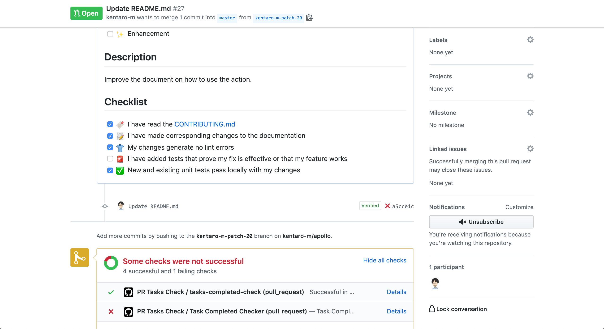

[GitHub Actionsのハッカソンを開催します - GitHubブログ](https://github.blog/jp/2020-03-09-were-challenging-you-to-create-your-very-own-github-actions/)

GitHubが3月5日から開催しているGitHub Actionsのオンラインハッカソンに参加しました。本日はハッカソンで作成したActionを紹介したいと思います。

## Pull Requestのチェックリストの完了確認を行うAction
[kentaro-m/task-completed-checker-action: A GitHub action that checks if all tasks are completed in the pull requests.](https://github.com/kentaro-m/task-completed-checker-action)

コードレビューの効率化を図るために、Pull Requestテンプレートを導入している開発現場は多いのではないでしょうか。このActionではPull Requestの説明に含まれるチェックリストの完了状況を確認し、CIステータスに反映します。テンプレートと一緒に使うことで効果を発揮します。

チェックリストの状況を見て、CIのステータスを変更します。



Actionのビルド結果の画面では完了と未完了のリストの一覧を表示します。


Actionを使う際はリポジトリの`.github/pull_request_template.md`に以下のようにテンプレートを追加します。`<!-- ignore-task-list-start -->`と`<!-- ignore-task-list-end -->`で囲んだ部分はチェックリストの確認が無視されるので、単一選択肢のチェックリストなどを含めます。

```md
## 説明
ユーザー認証機能を追加した。

## 変更タイプ
<!-- ignore-task-list-start -->
- [x] 機能追加
- [ ] バグ修正
- [ ] ドキュメント更新
- [ ] その他
<!-- ignore-task-list-end -->

## TODO
- [x] テストを追加する
- [x] 機能要件を満たしている
- [ ] ドキュメントを更新する
```

次にリポジトリの`.github/workflows/task-check.yml`にワークフローファイルを追加します。これでPull Requestの作成と編集のタイミングで、Actionが動作するようになります。

```yml
name: 'PR Tasks Completed Check'
on: 
  pull_request:
    types: [opened, edited]

jobs:
  task-check:
    runs-on: ubuntu-latest
    steps:
      - uses: kentaro-m/task-completed-checker-action@v0.1.0
        with:
          repo-token: "${{ secrets.GITHUB_TOKEN }}"
```

## Pull RequestにQRコード付きのコメントを追加するAction
[kentaro-m/qr-code-commenter-action: A GitHub Action that posts a QR code to a pull request comment.](https://github.com/kentaro-m/qr-code-commenter-action)

静的サイトを作るときにNetlifyやZeit Nowなどのホスティングサービスを使うことが多いのですが、Pull Request作成時にプレビューURLが発行されて、変更内容を確認できるので非常に便利です。このActionではスマートフォンでの実機確認でプレビューURLを素早く開くために、QRコードを生成して、Pull Requestにコメントします。

文字列で構成されるQRコードを生成し、Pull Requestのコメントに追加します。QRコード以外にも、任意のコメントを含めることが可能です。


Actionを使う際は、リポジトリの`.github/workflows/qr-comment.yml`にワークフローファイルを追加します。このAction自体は他のActionの実行結果 (`outputs`) の値を利用する前提となっています。そのため、他のステップでデプロイを行い、その結果出力された、プレビューURLを入力として利用して、QRコードを生成するのが良いと思います。

```yml
# 他のActionと組み合わせ利用する

uses: kentaro-m/qr-code-commenter-action@v0.1.2
with:
  repo-token: "${{ secrets.GITHUB_TOKEN }}"
  # 別のアクションの出力結果を入力値としてQRコードを生成できる
  content: "${{ steps.deploy.outputs.preview_url }}"
  comment: |
    :lock: This is a QR code for access to the preview website.
    :iphone: Scan a code with your device.
    {qrcode}
```

## さいごに
自分のアイデア次第でGitHubがさらに使いやすくすることができます。興味のある方は是非自作Actionの作成にチャレンジしてみてください。GitHub ActionsのOrganizationでTypeScriptとJavaScriptでActionを作るテンプレートが提供されており、お手軽に始められると思います。

- [actions/typescript-action: Create a TypeScript Action with tests, linting, workflow, publishing, and versioning](https://github.com/actions/typescript-action)
- [actions/javascript-action: Create a JavaScript Action with tests, linting, workflow, publishing, and versioning](https://github.com/actions/javascript-action)