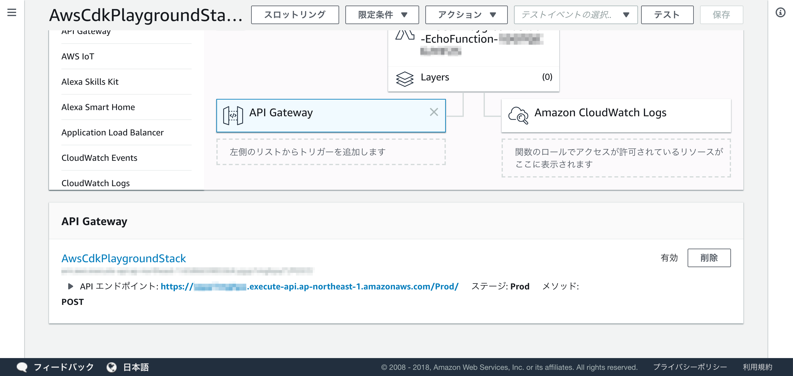

AWSのインフラ構成管理をプログラマブルに定義できるAWS CDKというツールを最近知りました。このツールを使って、API GatewayとLambdaで簡単なAPIを生やしてみたいと思います。

## AWS CDK (AWS Cloud Development Kit) とは
AWSのインフラ構成をTypeScript、Java、C#のコードで管理するツール。プロビジョニングはCloudFormationで行います。現在はdeveloper previewとして公開されており、GitHubのリポジトリでフィードバック及びコントリビュートを受け付けています。

* リポジトリ:
[awslabs/aws-cdk: The AWS Cloud Development Kit is a framework for defining cloud infrastructure in code](https://github.com/awslabs/aws-cdk)
* ドキュメント:
[Welcome — AWS Cloud Development Kit](https://awslabs.github.io/aws-cdk/)

## 今回目指すところ
POSTしたパラメータをそのまま返す簡単なAPIをAPI GatewayとLambdaで作ります。実際にAPIを実行したときの挙動は以下の通りです。

```bash
$ curl https://resource-name.execute-api.ap-northeast-1.amazonaws.com/Prod/ -d "hoge=fuga" -X POST
{"data":"hoge=fuga"}
```

## インストール方法
作業を始める前にNode.jsとAWS CLIが使えるか確認を行ってください。

参考情報: [AWS CLI の設定 - AWS Command Line Interface](https://docs.aws.amazon.com/ja_jp/cli/latest/userguide/cli-chap-configure.html)

`aws-cdk`コマンドをインストールして、プロジェクトを作成します。

```bash
$ npm install -g aws-cdk
$ mkdir aws-cdk-playground
$ cd aws-cdk-playground
# languageはcsharpとjavaも選択可能
$ cdk init app --language typescript
```

## Lambdaコードを追加

プロジェクト構成は以下の通りです。初期状態では`src`ディレクトリは存在していないので追加します。`src`ディレクトリにはLambdaのコードを配置し、`lib/aws-cdk-playground-stack.ts`にはリソースの定義を記述します。

```bash
.
├── README.md
├── bin
│   ├── aws-cdk-playground.d.ts
│   ├── aws-cdk-playground.js
│   └── aws-cdk-playground.ts
├── cdk.json
├── lib
│   ├── aws-cdk-playground-stack.d.ts
│   ├── aws-cdk-playground-stack.js
│   └── aws-cdk-playground-stack.ts -- リソースの定義を記述
├── package-lock.json
├── package.json
├── src -- Lambdaのコードを配置
│   ├── index.js
│   └── package.json
└── tsconfig.json
```

まずはLambdaのコードを`src`ディレクトリ配下に`index.js`という名前で追加します。コードの処理はリクエストパラメータをレスポンスに設定し、返しているだけです。

```js
const createResponse = (statusCode, body) => ({
  statusCode,
  body: JSON.stringify({
    data: body
  }),
  headers: {
    'Content-Type': 'application/json'
  }
 });

exports.handler = (event, context, callback) => {
  try {
    callback(null, createResponse(200, event.body));
  } catch (error) {
    console.log(error)
    callback(null, createResponse(500, error.message));
  }
};
```

## AWSリソースの定義を追加

次に`lib/aws-cdk-playground-stack.ts`にリソースの定義及び処理を追加します。

* LambdaコードをZIPファイルにまとめて、S3にアップロードする処理
* Lambdaのリソースの定義 (API Gateway経由のHTTPリクエストイベントで起動)

このタイミングで必要なnpmパッケージをインストールします。

```bash
$ npm install --save @aws-cdk/aws-serverless @aws-cdk/assets
```

リソースの定義は[Reference — AWS Cloud Development Kit](https://awslabs.github.io/aws-cdk/reference.html)の情報をもとに書いていきます。現時点ではdeveloper preview releaseの段階のため、breaking changesが含まれると注釈がありました。

```typescript
import path = require('path');
import cdk = require('@aws-cdk/cdk');
import serverless = require('@aws-cdk/aws-serverless');
import assets = require('@aws-cdk/assets');

export class AwsCdkPlaygroundStack extends cdk.Stack {
 constructor(parent: cdk.App, name: string, props?: cdk.StackProps) {
   super(parent, name, props);

	// 以下にスタックの定義を書く
	// LambdaのコードのZIPファイルにまとめて、S3にアップロード
   const echoAsset = new assets.ZipDirectoryAsset(this, 'EchoAsset', {
     path: path.resolve(__dirname, '../src')
   });

	// API GatewayとLambdaの定義
   new serverless.CfnFunction(this, 'EchoFunction', {
     codeUri: {
       bucket: echoAsset.s3BucketName,
       key: echoAsset.s3ObjectKey
     },
     handler: 'index.handler',
     runtime: 'nodejs8.10',
     memorySize: 128,
     timeout: 3,
     events: {
       api: {
         type: 'Api',
         properties: {
           path: '/',
           method: 'post'
         }
       }
     }
   } as serverless.CfnFunctionProps);
 }
}
```

## ビルドとデプロイ
プロジェクトを作成した際に`README.md`にビルドとデプロイで必要なコマンドが記載されています。基本的にはこれらのコマンドを使用することで、ビルドとデプロイが可能です。

```markdown:README.md
* `npm run build`   compile typescript to js
* `npm run watch`   watch for changes and compile
* `cdk deploy`      deploy this stack to your default AWS account/region
* `cdk diff`        compare deployed stack with current state
* `cdk synth`       emits the synthesized CloudFormation template
```

まずはTypeScriptをJavaScriptに変換するために`npm run build`コマンドを実行します。

```bash
$ npm run build

> aws-cdk-playground@0.1.0 build /Users/Kentaro/workspace/github.com/kentaro-m/aws-cdk-playground
> tsc
```

`cdk deploy`でデプロイが開始します。

```bash
$ cdk deploy
AwsCdkPlaygroundStack: deploying...
AwsCdkPlaygroundStack: creating CloudFormation changeset...
0/9 | 8:03:34 PM | CREATE_IN_PROGRESS   | AWS::CDK::Metadata        | CDKMetadata
0/9 | 8:03:34 PM | CREATE_IN_PROGRESS   | AWS::IAM::Role            | EchoFunctionRole
0/9 | 8:03:35 PM | CREATE_IN_PROGRESS   | AWS::IAM::Role            | EchoFunctionRole Resource creation Initiated
0/9 | 8:03:37 PM | CREATE_IN_PROGRESS   | AWS::CDK::Metadata        | CDKMetadata Resource creation Initiated
1/9 | 8:03:37 PM | CREATE_COMPLETE      | AWS::CDK::Metadata        | CDKMetadata
2/9 | 8:03:46 PM | CREATE_COMPLETE      | AWS::IAM::Role            | EchoFunctionRole
2/9 | 8:03:50 PM | CREATE_IN_PROGRESS   | AWS::Lambda::Function     | EchoFunction
2/9 | 8:03:50 PM | CREATE_IN_PROGRESS   | AWS::Lambda::Function     | EchoFunction Resource creation Initiated
3/9 | 8:03:50 PM | CREATE_COMPLETE      | AWS::Lambda::Function     | EchoFunction
3/9 | 8:03:53 PM | CREATE_IN_PROGRESS   | AWS::ApiGateway::RestApi  | ServerlessRestApi
3/9 | 8:03:54 PM | CREATE_IN_PROGRESS   | AWS::ApiGateway::RestApi  | ServerlessRestApi Resource creation Initiated
4/9 | 8:03:54 PM | CREATE_COMPLETE      | AWS::ApiGateway::RestApi  | ServerlessRestApi
4/9 | 8:03:57 PM | CREATE_IN_PROGRESS   | AWS::Lambda::Permission   | EchoFunctionapiPermissionTest
4/9 | 8:03:57 PM | CREATE_IN_PROGRESS   | AWS::Lambda::Permission   | EchoFunctionapiPermissionProd
4/9 | 8:03:57 PM | CREATE_IN_PROGRESS   | AWS::Lambda::Permission   | EchoFunctionapiPermissionTest Resource creation Initiated
4/9 | 8:03:57 PM | CREATE_IN_PROGRESS   | AWS::ApiGateway::Deployment | ServerlessRestApiDeployment68b257dd2d
4/9 | 8:03:57 PM | CREATE_IN_PROGRESS   | AWS::Lambda::Permission   | EchoFunctionapiPermissionProd Resource creation Initiated
4/9 | 8:03:58 PM | CREATE_IN_PROGRESS   | AWS::ApiGateway::Deployment | ServerlessRestApiDeployment68b257dd2d Resource creation Initiated
5/9 | 8:03:58 PM | CREATE_COMPLETE      | AWS::ApiGateway::Deployment | ServerlessRestApiDeployment68b257dd2d
5/9 | 8:04:01 PM | CREATE_IN_PROGRESS   | AWS::ApiGateway::Stage    | ServerlessRestApiProdStage
5/9 | 8:04:02 PM | CREATE_IN_PROGRESS   | AWS::ApiGateway::Stage    | ServerlessRestApiProdStage Resource creation Initiated
6/9 | 8:04:03 PM | CREATE_COMPLETE      | AWS::ApiGateway::Stage    | ServerlessRestApiProdStage
7/9 | 8:04:08 PM | CREATE_COMPLETE      | AWS::Lambda::Permission   | EchoFunctionapiPermissionTest
8/9 | 8:04:08 PM | CREATE_COMPLETE      | AWS::Lambda::Permission   | EchoFunctionapiPermissionProd
9/9 | 8:04:10 PM | CREATE_COMPLETE      | AWS::CloudFormation::Stack | AwsCdkPlaygroundStack

✅  AwsCdkPlaygroundStack

Stack ARN:
arn:aws:cloudformation:ap-northeast-1:123456789012:stack/AwsCdkPlaygroundStack/87d4b4f0-076b-11e9-9c1f-068e63cf27c0
```

デプロイが成功したら、Lambdaコンソール内のAPI Gatwayの設定ページに移動し、エンドポイントを確認します。



実際にエンドポイントに対して、パラメータ付きPOSTリクエストを実行して、正常に動作することを確認します。

```bash
$ curl https://resource-name.execute-api.ap-northeast-1.amazonaws.com/Prod/ -X POST -d "foo=bar"
{"data":"foo=bar"}
```

## スタックの削除
`cdk destroy`コマンドを実行すると、スタックの削除が可能です。

## スタック変更確認
`cdk diff`で現在デプロイされているスタックとの変更点を確認できます。

```bash
cdk diff
Template
[+] Transform Transform: AWS::Serverless-2016-10-31

IAM Statement Changes
┌───┬─────────────────┬────────┬───────────────────────┬──────────────────────────────────┬───────────────────────────────────────────────────────────────────────────────────────────────────────────────────────────────────────────────────────────────────────────────────────────────┐
│   │ Resource        │ Effect │ Action                │ Principal                        │ Condition                                                                                                                                                                                     │
├───┼─────────────────┼────────┼───────────────────────┼──────────────────────────────────┼───────────────────────────────────────────────────────────────────────────────────────────────────────────────────────────────────────────────────────────────────────────────────────────────┤
│ - │ ${EchoFunction} │ Allow  │ lambda:invokeFunction │ Service:apigateway.amazonaws.com │ "ArnLike": {                                                                                                                                                                                  │
│   │                 │        │                       │                                  │   "AWS:SourceArn": "{\"Fn::Sub\":[\"arn:aws:execute-api:${AWS::Region}:${AWS::AccountId}:${__ApiId__}/${__Stage__}/POST/\",{\"__Stage__\":\"*\",\"__ApiId__\":\"${ServerlessRestApi}\"}]}"    │
│   │                 │        │                       │                                  │ }                                                                                                                                                                                             │
├───┼─────────────────┼────────┼───────────────────────┼──────────────────────────────────┼───────────────────────────────────────────────────────────────────────────────────────────────────────────────────────────────────────────────────────────────────────────────────────────────┤
│ - │ ${EchoFunction} │ Allow  │ lambda:invokeFunction │ Service:apigateway.amazonaws.com │ "ArnLike": {                                                                                                                                                                                  │
│   │                 │        │                       │                                  │   "AWS:SourceArn": "{\"Fn::Sub\":[\"arn:aws:execute-api:${AWS::Region}:${AWS::AccountId}:${__ApiId__}/${__Stage__}/POST/\",{\"__Stage__\":\"Prod\",\"__ApiId__\":\"${ServerlessRestApi}\"}]}" │
│   │                 │        │                       │                                  │ }                                                                                                                                                                                             │
└───┴─────────────────┴────────┴───────────────────────┴──────────────────────────────────┴───────────────────────────────────────────────────────────────────────────────────────────────────────────────────────────────────────────────────────────────────────────────────────────────┘
(NOTE: There may be security-related changes not in this list. See http://bit.ly/cdk-2EhF7Np)

Resources
[-] AWS::IAM::Role EchoFunctionRole destroy
[-] AWS::ApiGateway::Stage ServerlessRestApiProdStage destroy
[-] AWS::Lambda::Permission EchoFunctionapiPermissionTest destroy
[-] AWS::Lambda::Permission EchoFunctionapiPermissionProd destroy
[-] AWS::ApiGateway::Deployment ServerlessRestApiDeployment68b257dd2d destroy
[-] AWS::ApiGateway::RestApi ServerlessRestApi destroy
[~] AWS::Serverless::Function EchoFunction EchoFunction replace
```

## テンプレート出力
`cdk synth`コマンドでCloudFormationテンプレートが出力されます。

## 所感
型付き言語でリソースを定義するので、エディタやIDEで補完が効くのが書いていて気持ち良かったです。

また、プログラマブルに記述できることでYAMLやJSONよりは全体の見通しが良くなり、Pull Requestベースでの構成レビューがしやすくなるのではないかと感じました。

現時点ではプレビュー版のため、業務使用は難しいですが、今後も開発状況をウォッチしていきたいと思います。

今回使ったリポジトリ:
[kentaro-m/aws-cdk-playground: Building the serverless application using AWS CDK.](https://github.com/kentaro-m/aws-cdk-playground)
