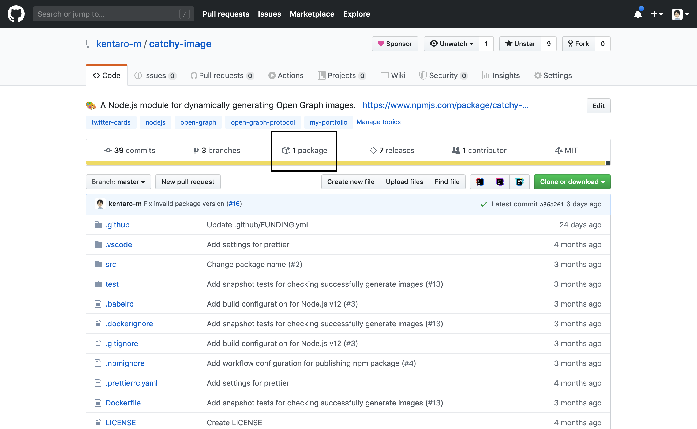
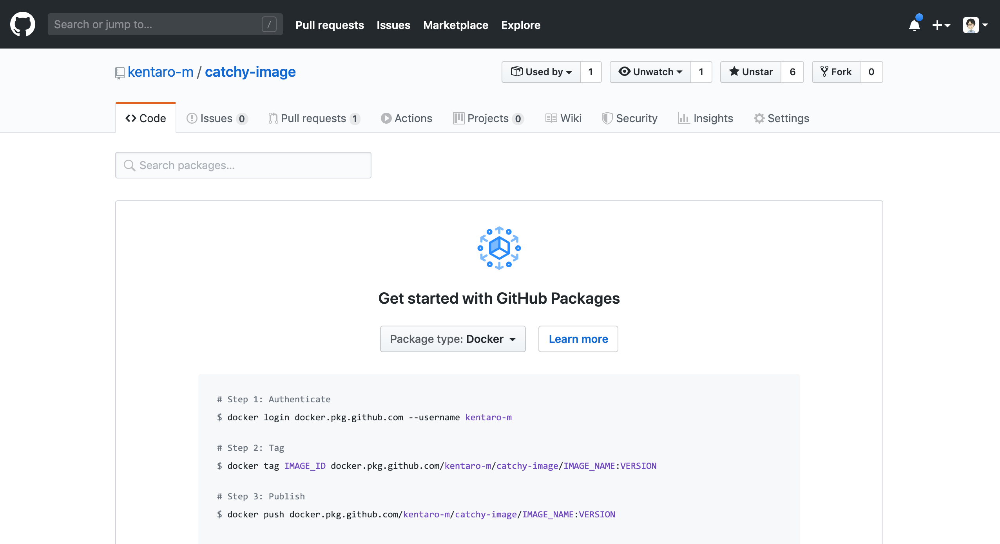
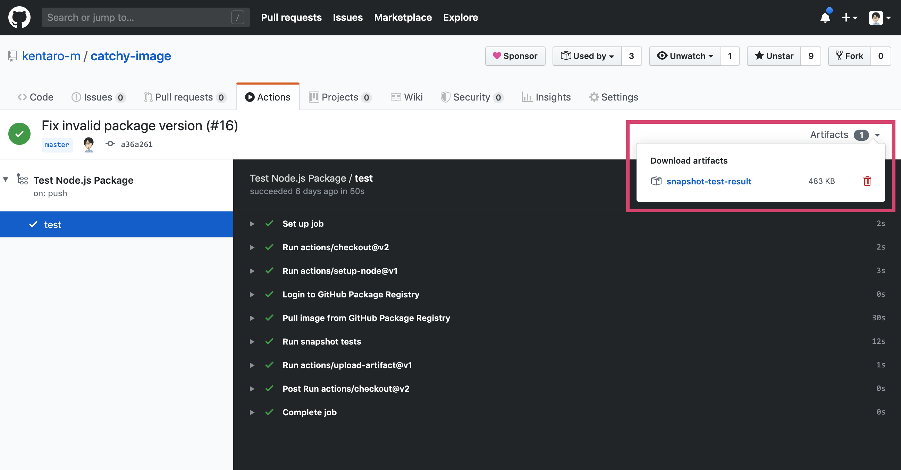

[OGP画像を動的生成するライブラリを開発した話](https://blog.kentarom.com/create-gatsbyjs-plugin-to-dynamically-generate-og-images/)を以前書きましたが、今回は画像生成が正しく行われているかを画像のスナップショットテストで検証する方法を試してみました。

本記事では、前半はローカル開発環境でのJestを利用したスナップショットテストのセットアップ、後半は実行環境に依存しないスナップショットテストの実行方法を紹介します。

## UIの意図しない変更を検知するスナップショットテスト
そもそも、スナップショットテストとは何かという話をしたい思います。

Webサイトやスマートフォンアプリなどは、ユーザーにリリースされてからも、様々な機能の追加や改善、バグ修正などが、開発者によって行われます。その際に、既存コードの変更により、意図せずにUIが変わってしまうときがあります。

スナップショットテストでは、既存コードの変更前後のUIスクリーンショットを撮影し、比較することで、意図しないUI変更を開発段階で検知することが可能となります。

実際にスナップショットテストを実行して、UIの差分を検知した例が以下の画像となります。


## Jestを利用して、スナップショットテストを書く
すでに、Jestでテストが実行できる環境が整備されている前提で、スナップショットテストを書いていきます。

まずは、American ExpressからOSSで公開されている[Jest Image Snapshot](https://github.com/americanexpress/jest-image-snapshot)というJest向けのMatcherをインストールします。

```shell
$ npm install --save-dev jest-image-snapshot
```

次に、テストファイルでJest Image Snapshotをインポートします。Jestの`expect`オブジェクトを拡張することで、独自のMatcherを導入できます。今回はスナップショットテスト用のマッチャーを追加しています。

```js
const { toMatchImageSnapshot } = require('jest-image-snapshot')

// スナップショット確認用のアサーションメソッドを導入
expect.extend({ toMatchImageSnapshot })
```

ここまで準備ができたら、実際にテストを書いていきます。基本的な流れは以下の通りです。

1. テスト対象のライブラリを利用して、画像を生成して、ファイル書き出し
2. 書き出された画像ファイルを読み込む
3. `toMatchImageSnapshot`メソッドを利用して、スナップショットと画像ファイルを比較する


```js
const { toMatchImageSnapshot } = require('jest-image-snapshot')
const catchy = require('../src')
const fs = require('fs').promises

// スナップショット確認用のアサーションメソッドを導入
expect.extend({ toMatchImageSnapshot })

describe('.generate()', () => {
  it('generates an image if specifies a custom background image.', async () => {
    const options = {
      output: {
        directory: 'test',
        fileName: '1.png',
      },
      image: {
        width: 1200,
        height: 630,
        backgroundColor: '#222639',
        backgroundImage: require.resolve('../src/images/background.jpg'),
      },
      style: {
        title: {
          fontFamily: 'Noto Sans CJK JP',
          fontColor: '#f0f5fa',
          fontWeight: 'bold',
          fontSize: 64,
          paddingTop: 100,
          paddingBottom: 200,
          paddingLeft: 150,
          paddingRight: 150,
        },
        author: {
          fontFamily: 'Noto Sans CJK JP',
          fontColor: '#f0f5fa',
          fontWeight: '400',
          fontSize: 42,
        },
      },
      meta: {
        title: 'How to dynamically create  an Open Graph image.',
        author: 'Kentaro Matsushita',
      },
      fontFile: [
        {
          path: require.resolve('../src/fonts/NotoSansCJKjp-Bold.otf'),
          family: 'Noto Sans CJK JP',
          weight: 'bold',
        },
        {
          path: require.resolve('../src/fonts/NotoSansCJKjp-Regular.otf'),
          family: 'Noto Sans CJK JP',
          weight: '400',
        },
      ],
      iconFile: require.resolve('../src/images/avatar.jpeg'),
      timeout: 10000,
    }

    // 画像を生成する
    const imagePath = await catchy.generate(options)

    // 生成された画像を読み込む
    const imageData = await fs.readFile(imagePath)

    // スナップショットを比較する
    expect(imageData).toMatchImageSnapshot()
  })
})
```

テストを書いたあとに、シェルで`jest`コマンドを実行すると、テストが実行されて、結果が出力されます。

```shell
$ jest
```

`test/__image_snapshots__/`ディレクトリ配下を確認すると、テストで保存されたスナップショットを見ることができます。

テストケース1で保存されたスナップショット


テストケース2で保存されたスナップショット


また、テストが失敗した場合 (=以前のスナップショットとの差分がある場合)、`test/__image_snapshots__/__diff_output__/`ディレクトリ配下に差分が分かる画像が書き出されます。


ちなみに、テストが失敗しているものの、UIが意図した変更である場合は、Jest実行時のオプションに`--updateSnapshot`を追加することで、スナップショットを更新します。

```shell
$ jest --updateSnapshot

# alias
$ jest -u
```

## Dockerを導入して、常に同じ環境でテストを実行する
ローカル開発環境でスナップショットテストが実行できるようになったので、GitHub Actionsでも動作するように環境を整備し始めました。

そこで直面したのは、テストの実行環境ごとに異なるテスト結果が出るという問題でした。このとき、ランタイムはNode.jsを使用し、ローカルではmacOS、GitHub ActionsではUbuntuでテストを実行していました。


この問題を解決するために、Dockerを導入して、常に同じ環境でテストが実行できるようにしました。

まずは、Node.jsのDockerイメージを使用して、スナップショットテストを実行する`Dockerfile`を作成します。

```dockerfile
FROM node:12.14
WORKDIR /usr/src/app
COPY package.json .
RUN npm install
COPY . .
CMD npm test
```

次に、Dockerイメージをビルドして、Dockerコンテナ上でテストを実行します。これが成功したら、ローカルでの動作確認は完了です。

```shell
$ docker build -t snapshot-test:latest .
$ docker run -v `pwd`/test:/usr/src/app/test snapshot-test:latest

> catchy-image@0.1.6 test /usr/src/app
> jest

Fontconfig warning: "/etc/fonts/fonts.conf", line 100: unknown element "blank"
PASS test/index.test.js
  .generate()
    ✓ generates an image if specifies a custom background image. (913ms)
    ✓ generates an image if specifies a custom background color. (756ms)

Test Suites: 1 passed, 1 total
Tests:       2 passed, 2 total
Snapshots:   2 passed, 2 total
Time:        5.331s
Ran all test suites.
```

GitHub Actionsでも、Dockerコンテナを利用して、テストを実行するために、GitHub PackageにDockerイメージをプッシュしたいと思います。

GitHubのリポジトリページから、GitHub Packageのページに移動します。



GitHub Packageのページで、`Package type`を`Docker`に変更すると、Dockerイメージをプッシュするために、必要なコードが出てきます。こちらを順番にやっていけば、イメージのプッシュができます。



まずは、`docker login`コマンドで、GitHub Package (Dockerレジストリ) にログインします。

この際にパスワードが必要となりますが、GitHubのPersonal Access Tokenを利用するので、`read:packages`、`repo`、`write:packages`の権限を付与したものを事前に発行しておきます。

```shell
$ docker login docker.pkg.github.com --username kentaro-m
Password:
Login Succeeded
```

次に、GitHub PackageにプッシュするDockerイメージをビルドします。イメージ名を`snapshot-test`、バージョンをセマンティックバージョニングで`0.1.0`に設定しました。

```shell
$ docker build -t IMAGE_NAME:VERSION .

# e.g. 
$ docker build -t snapshot-test:0.1.0 .
```

ビルドしたDockerイメージにタグを追加します。

```shell
$ docker tag IMAGE_ID docker.pkg.github.com/kentaro-m/catchy-image/IMAGE_NAME:VERSION

# e.g. 
$ docker tag eae014ba9a43 docker.pkg.github.com/kentaro-m/catchy-image/snapshot-test:0.1.0
```

GitHub PackageにDockerイメージをプッシュします。

```shell
$ docker push docker.pkg.github.com/kentaro-m/catchy-image/IMAGE_NAME:VERSION

# e.g.
docker push docker.pkg.github.com/kentaro-m/catchy-image/snapshot-test:0.1.0
```

さいごに、GitHub Actionsのワークフローを定義します。今回は`.github/workflows/test.yml`に記載しました。

このときに必要に応じて、GitHub Packageへの接続情報をGitHub ActionsのSecretsに登録します。なお、GitHubのトークンはリポジトリごとに自動で発行されているものがあるので、手動での追加は不要です。

```yml
name: Test Node.js Package
on: push
jobs:
  test:
    runs-on: ubuntu-latest
    steps:
    - uses: actions/checkout@v2

    - uses: actions/setup-node@v1
      with:
        node-version: '12.x'

    # GitHub Packageにログインする
    - name: Login to GitHub Package Registry
      run: docker login docker.pkg.github.com -u kentaro-m -p ${{ secrets.GITHUB_TOKEN }}

    # GitHub PackageからDockerイメージをPull
    # GitHub ActionsのSecretsに登録した内容は、${{ secrets.HOGE_NAME }} でアクセスできる
    - name: Pull image from GitHub Package Registry
      run: docker pull ${{ secrets.REGISTRY_HOST }}/${{ secrets.IMAGE_NAME }}:${{ secrets.IMAGE_TAG }}

    # テストを実行する
    - name: Run snapshot tests
      run: docker run -v `pwd`/test:/usr/src/app/test ${{ secrets.REGISTRY_HOST }}/${{ secrets.IMAGE_NAME }}:${{ secrets.IMAGE_TAG }}

    # テスト実行結果をArtifactに保存する
    - uses: actions/upload-artifact@v1
      if: always() # テストが失敗したときも、テスト結果をArtifactに保存する
      with:
        name: snapshot-test-result
        path: test
```

このワークフローをリモートリポジトリにPushすると、テストが実行されます。GitHub Actionsのタブに移動すると、テストの実行結果を確認することができ、Artifactからダウンロードできます。



## さいごに
Jestのスナップショットテストで画像生成ライブラリの挙動を検証してみました。

今回はテストケースが非常に少ないので、労力なくテストを導入することができました。ただ、テスト実行結果の真偽の見極めは人間が介入する必要があるので、テストケースが増えると、運用の負担が高まってきそうです。

