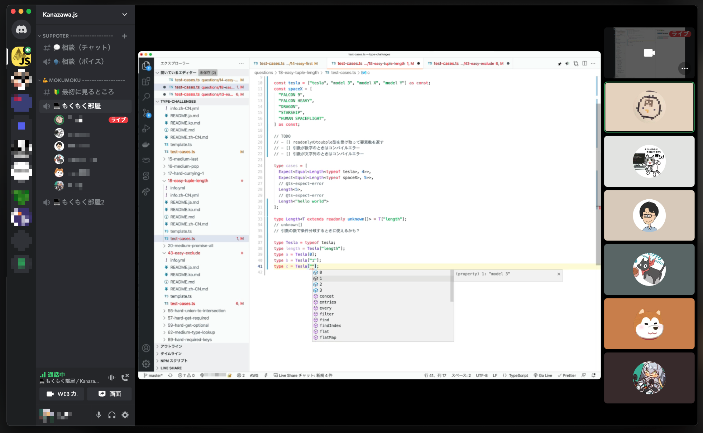

1月29日 (土) に[Kanazawa.js もくもく会 #17 ~type-challengesで"型"を学ぼう会~](https://kanazawajs.connpass.com/event/231583/)を開催しました。本記事ではイベントの模様を紹介したいと思います。

## type-challengesへの挑戦
今回のイベントでは、参加者で協力して[type-challenges](https://github.com/type-challenges/type-challenges)というTypeScriptの型についての問題集を解きました。

type-challengesについては以下の記事が参考になると思います。

- [TypeScriptの"型"を学びたいあなたへ。type-challengesのすゝめ - Qiita](https://qiita.com/ryo2132/items/925b96838dd8cca7cebd)
- [フロントエンドメンバーのTS型力向上を狙ったtype-challenges活用術 - HRBrain Blog](https://times.hrbrain.co.jp/entry/2021/11/17/how-to-use-type-challenges)

### 個人的な学び
問題は難易度別に用意されており、Easyから解いていきました。普段はBasic Typesを使うことがほとんどで、問題を解くための知識が足らず苦戦しました。

Utility Typesなどの組み込み型の再実装が求められるものが多く、下記に挙げたようなTypeScriptのドキュメントを確認する良い機会になったと思います。

- [TypeScript: Documentation - Utility Types](https://www.typescriptlang.org/docs/handbook/utility-types.html)
- [TypeScript: Documentation - Mapped Types](https://www.typescriptlang.org/docs/handbook/2/mapped-types.html)
- [TypeScript: Documentation - Conditional Types](https://www.typescriptlang.org/docs/handbook/2/conditional-types.html)

### イベントの進め方
運営者視点でイベントの進め方に触れておきます。イベントは下記の流れで進めました。

1. type-challengesの紹介
2. 参考ドキュメントの紹介
3. チーム決め
4. 各チームで問題を解く
5. 各チーム間で解答・知見を共有

各チーム30分で複数問題を解いて、各チーム間で解答や知見を共有するという一連の流れを3セット行いました。

1チーム3人で構成し、VSCode Live Shareでモブプロができる状態を作り、Discordでボイスチャットしながら、問題を解いていきました。

参加者間でTypeScriptの経験に差があったものの、集合知を活かして取り組めたと思います。

## さいごに
来週2月26日(土) に[Kanazawa.js もくもく LT会 #18](https://kanazawajs.connpass.com/event/238698/)を開催するので、ご興味ある方はぜひ参加してください。