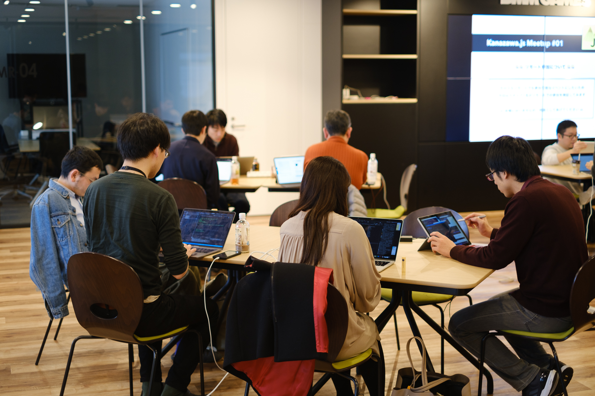

2020年1月19日(日)に[Kanazawa.js meetup #1](https://kanazawajs.connpass.com/event/161078/)を開催しました。本記事ではイベントの模様と運営者としての所感をお送りしたいと思います。

## Kanazawa.jsとは
金沢周辺で実施している「実際に手を動かして、ゆるく交流できる勉強会」をコンセプトにした、 有志で運営される、JSerのためのゆるふわ地域コミュニティです。

これからJavaScriptを学び始めるビギナーから、更に知見を深めたい上級者まで、 金沢周辺の方に限らずJavaScriptに興味がある方なら、誰でも参加できます。聞くだけではなく、各々が実際にやった事を雑に共有することで、 参加者同士で、ゆるく成長できる場を作れたらいいなという思いで誕生しました。

コミュニティ立ち上げの経緯やコンセプトの詳細は[@yu_kgr](https://twitter.com/yu_kgr)の記事をご覧ください。

[コミュニティ立ち上げに対する想い & 振り返り - kglabo.blog](https://blog.kglabo.com/entry/2020/01/28/013636)

現在は[@yu_kgr](https://twitter.com/yu_kgr)、[@tom256](https://twitter.com/uTWbzhZlU6)、[@kentarom](https://twitter.com/_kentaro_m)の3人でコミュニティの運営をしています。はじめての開催となったKanazawa.js meetup #1ではもくもく会と有志によるLT発表を行いました。

## もくもく会
もくもく会ではイベントの始めに参加者が何の作業を行うかを宣言し、各々作業を進めていきました。Gatsby.jsやReact Native、Next.jsの学習、デザイン本やJavaScript本の読書、LT発表資料作りなど、多様な作業が行われていました。

## LT発表
LT発表では6人の方に発表していただきました。

### 開発時のコミュニケーションを円滑化するBOTを作った話
[@yu_kgr](https://twitter.com/yu_kgr)からはGitLabのMerge Requestのイベントをフックして、適切な通知先に通知するSlack Botを開発し、レビュー依頼の自動化を実現したという発表でした。通知の仕方を工夫して、レビューコミュニケーションを改善した点は良いBotの活用例だと思いました。

<Slide id='36fbc1f253484916ab7edfe3bfb60946' />

### ハックしなければクリアできないRPG 「ハックフォープレイ」の紹介
[@teramotodaiki](https://twitter.com/teramotodaiki)さんからはプログラミングを楽しみながら学べるハックフォープレイというゲームを紹介していただきました。今の子どもたちのプログラミング学習事情が知れて興味津々でした。サービスのアーキテクチャも面白かったです。

<Slide id='0487598d061d402888babecc53de52d8' />

### GatsbyJS と Contentful を用いた静的 Web サイト運用のすゝめ
[@saitoeku3](https://twitter.com/saitoeku3)さんからGatsbyJSとContentfulを使った静的Webサイトの開発・運用して得た知見を発表いただきました。アーティストのファンサイトを作成するために、要件から適切な技術選定を行った点が印象的でした。

<Slide id='967a5685231c496bafa1ae28ebb60ee8' />

### OGP画像を生成するNode.jsのライブラリを作ってみた
私からはNode canvasを使用して、OGP画像を動的生成するライブラリを作成したという内容の発表を行いました。SNSに記事をシェアした際の見栄えを良くするために開発しました。

<Slide id='b81766906fec4f229e905d300e96e53b' />

### JavaScript を書き始める前にやっておきたいこと
[@ur_uha](https://twitter.com/ur_uha)さんからはツール導入でJavaScriptの書き方にチーム内で統一性をもたせることにより、書き方で疲弊せず、本来の開発目的に注力できるという内容でした。プロジェクトのはじめに少しの労力をかけることで、コードの秩序が保たれるので、大事なことだと思いました。

<Slide id='e6c7ad4ce3714c2584aad225fb8a341f' />

### 脱レガシーフロントエンドのために知っておいたほうがいいこと
[@mugi_uno](https://twitter.com/mugi_uno)さんからはレガシーフロントエンドから脱却に取り組む際の向き合い方の発表をいただきました。さまざまな観点から小さくして、作業を進めると、安全に改善できるという点は非常に同意できる内容でレガシーコードを改修する際に意識したいと思いました。

<Slide id='424cf34287054d2da783efa2b6a9c287' />

## イベント運営してみての所感

- 良かったこと
  - 20人の方に参加していただいた
  - GitHub Issueでイベント開催までのタスクを管理したのが良かった
  - ポジションペーパーで参加者のことを知ることができた
  - SlackでLT感想やもくもく中の質問等のコミュニケーションが多かった
- 課題
  - 現地の交流が少なかった

### 20人の方に参加していただいた
初回のイベントであり、参加者が集まるのか不安を抱えていましたが、結果的に20人の方に参加していただき、非常に驚いています。

### GitHub Issueでイベント開催までのタスクを管理したのが良かった
コミュニティ立ち上げにあたっては近隣のコミュニティである[Kanazawa.rb](https://kanazawarb.github.io/meetup/)の運営方法を参考にさせていただきました。イベントの開催に必要なタスクをGitHub Issueとして作成し、運営者は時間があるときに各自でIssueを消化するスタイルをとりました。タスクの可視化を実現し、進行状況が逐一確認できて、良かったです。

### ポジションペーパーで参加者のことを知ることができた
参加者には任意でポジションペーパーをGistで用意していただきました。興味をもっていることやKanazawa.jsでやりたいことやJavaScript関しての経験などを共有していただくことで、参加者同士がお互いを知るきっかけになったと思います。

### SlackでLT感想やもくもく中の質問等のコミュニケーションが多かった
参加者には専用のSlackワークスペースに参加していただき、イベント中のコミュニケーションをとる手段を準備しました。もくもく作業しているときの実況や最近興味のある技術共有、JavaScriptに関する質問などの参加者同士のコミュニケーションが見られて嬉しかったです。

### 現地の交流が少なかった
オンラインのコミュニケーションはとっていた一方で、現地での参加者同士のコミュニケーションに関しては、改善の余地があるのではないかと感じました。LTやもくもく会などを行うイベントの特性上、単独で作業するか、話を聞いているかになりがちなので、次回のイベントではピザを食べながら、参加者同士で交流できる懇親会枠を計画しています。

本イベントの終了後に運営メンバーでふりかえりを行い、良かった点と改善できる点について、確認を行いました。次回以降はさらに良いイベントになるように努めていきます。

## さいごに
参加していただいた皆さんありがとうございました。次回の[Kanazawa.js meetup #2](https://kanazawajs.connpass.com/event/164396/)は2月29日(土)の開催です。
すでに募集開始済みなので、ご興味ある方はお気軽に参加ください。
