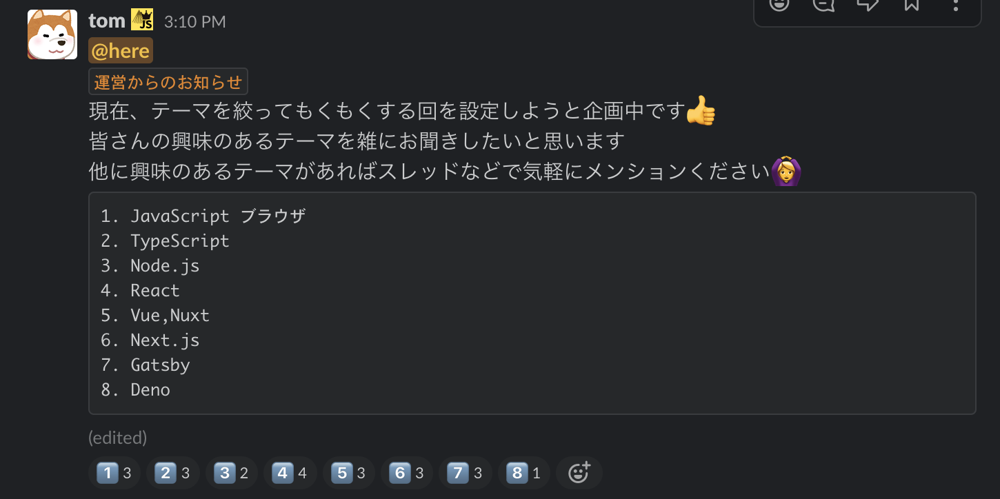

5月23日 (土) に[Kanazawa.js Remote Meetup #03](https://kanazawajs.connpass.com/event/175040/)を開催しました。本記事ではイベントの模様を紹介したいと思います。

## MeetupにSpatial Chatを利用しました
今回のMeetupは[Spatial Chat](https://spatial.chat/)を利用して開催しました。

Spatial Chatは無料のビデオチャットサービスで50人まで同時利用が可能です。特徴的なのは、現実世界と同じように、人と人の距離の概念があることです。チャットを開始するときに、ワークスペースと呼ばれる部屋が作成されます。参加者同士が部屋内で近づくと、声が大きく聞こえて、参加者同士が離れると、声が小さく聞こえます (距離によって聞こえなくなる)。

この特徴を利用すれば、ワークスペース内で複数のグループに分かれて、別々の話題を話すことができます。Google MeetやZoomにはない体験で非常に面白いです。

管理者はワークスペース内に画像を自由に配置することができるので、今回のMeetupでは雑談やLT発表、もくもくなどの用途ごとのスペースを設定し、都度参加者に移動してもらうことにしました。

## もくもく会
もくもく会では、Next.jsのチュートリアルやDenoの入門、ポートフォリオサイトの作成、GatsbyJS製ブログの機能追加など、参加者がそれぞれ選択した技術に触れていました。

<Tweet tweetLink="yu_kgr/status/1264060189646286850" />

## LT発表
<Tweet tweetLink="_kentaro_m/status/1264098485835456513" />

### JavaScript を書き始める前に知っておきたい JavaScript のこと #02
[@ur_uha](https://twitter.com/ur_uha)さんからはJavaScriptのプロトタイプチェーンに関して発表いただきました。普段JavaScriptを書く際に何も意識せずとも、オブジェクトのビルトインメソッドが利用できますが、動作原理を知ることでデバッグがしやすくなると思いました。

<Slide id='38a32df7f14848fbbf224edcaf529e80' />

### Actions ToolkitではじめるGitHub Action開発
私からは自作のGitHub Actionを作成から公開するまでの流れを発表しました。GitHubが公開している[GitHub Actions Toolkit](https://github.com/actions/toolkit)というライブラリを使用すると、簡単に自作のActionが作れて、GitHubの作業を効率化することができるので、是非一度試していただきたいです。

<Slide id='79371764ab7e4763ac9b97430468a652' />

### Gatsby + React + Redux によるゼロリスク・ハイリターンな個人開発
@taumuさんからは個人開発のReactアプリケーション拡張時の技術選定とGatsbyJSとReduxを組み合わせた構成の実現について発表いただきました。既存のReactアプリケーションをGatsbyJSにマイグレーションした事例は参考になりました。

<Slide id='d4e7ad66617f445eb25656f897bde204' />

## さいごに
今回も参加者から様々なJavaScriptの知見が共有されて、良いイベントになったと思います。次回は運営のほうで、テーマを決めて、もくもくする会を計画しています。
今後も引き続きお互いに学び合う場が提供できるように取り組んでいきます。次回の参加もお待ちしています。

