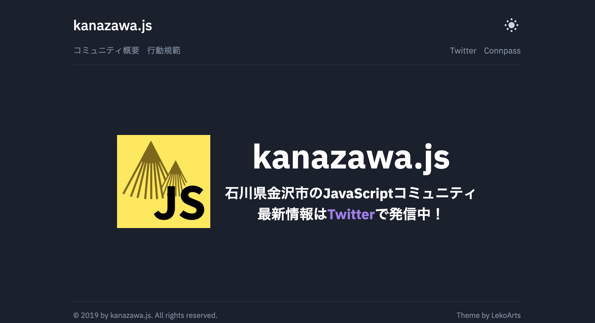

大晦日なので、2019年の個人的な振り返りをしたいと思います。

## 仕事

今年前半 (1月〜6月) は昨年に引き続き、認証基盤システムの運用・保守を担当するWebアプリケーションエンジニアとして働いていました。DatadogやRedashをチーム内に布教して、サービスの状態や利用状況の可視化に取り組みました。また、サービスを長年に渡って支えてきたレガシー基盤を脱却するために、現状の課題をまとめたり、理想の基盤をチームで考えたりしていました。

今年後半 (7月〜12月) はグループ会社に転籍し、ゲームプラットフォームの開発プロジェクトにフロントエンドエンジニアとして参画しました。特定の領域 (フロントエンド) を深堀りしたい気持ちが出てきたことや今後のキャリアとして、テックリードのような[役割](https://medium.com/@shimpeiws/techlead-947147698f89) (自身の技術力やリーダーシップでチームの生産性を向上させる) を担える力をつけたいと考えたことが転籍の理由でした。

転籍後はプロジェクトを前進させるために、チームをリードする動きが求められ、 プロジェクトやチームのマネジメントに割く時間が多くなりました。これまでは誰かがやっていることを見ることがあっても、自らやったことがなかったので、非常に良い経験になりました (取り組んだことは先日のkanazawa.rbでLTしました)。

`slide: https://speakerdeck.com/kentarom/things-i-have-learned-in-leading-the-team`

一方で、技術的な部分のコミットが少ない課題がありました。フロントエンドチーム横断で抱えている技術的な課題の解決や自チームのアプリケーションのアーキテクチャ検討などを同僚にお任せすることが多く、学びの機会を活かすことができませんでした。来年は技術で課題解決を図っていきたいと思います。

## イベント参加
金沢近郊のイベントとカンファレンスにいくつか参加しました。ブログなどのアウトプットがなかった。

- kanazawa.rb meetup
- HashiCorp Terraform & Vault Enterprise 勉強会 in 金沢
- Algolia 勉強会 in 金沢
- 富山Ruby会議01
- JSConf JP

## リポジトリ
今年作ったリポジトリをリストにしました。TypeScriptの勉強のために、TypeScriptを使用したものが多かったです。

- [kentaro-m/auto-assign-action: An action which adds reviewers to the pull request when the pull request is opened.](https://github.com/kentaro-m/auto-assign-action)
  - Pull Requestにランダムでレビューを追加するGitHub Action
- [kentaro-m/honyaku-flag: A Slack app that translates a message when an emoji reaction added to the message.](https://github.com/kentaro-m/honyaku-flag)
  - Slackでメッセージに国旗emojiをつけると、翻訳してくれるBot
  - 会社のワークスペースで動かしている
- [kentaro-m/mkissue: Create GitHub issues from importing CSV file.](https://github.com/kentaro-m/mkissue)
  - CSVファイルからGitHub Issueを大量生成するCLIツール
- [kentaro-m/task-complete-checker: A Probot app that checks if all tasks are completed in the pull requests.](https://github.com/kentaro-m/task-complete-checker)
  - Pull Requestの説明欄のチェックリストにすべてチェックがついている確認するGitHub App
- [kentaro-m/add-an-issue-reference-action: A GitHub Action for adding a related issue reference to a pull request.](https://github.com/kentaro-m/add-an-issue-reference-action)
  - ブランチ名からGitHubのIssueとPull Requestの参照を追加するGitHub Action
- [kentaro-m/learn-something-new: Knowledge is power.](https://github.com/kentaro-m/learn-something-new)
  - マイブログ
- [kentaro-m/portfolio-gatsby: kentarom's portfolio site](https://github.com/kentaro-m/portfolio-gatsby)
  - マイポートフォリオ

## さいごに
来年もよろしくお願いします！

さいごにお知らせなのですが、1月19日に金沢周辺でJavaScriptに関する知見を共有したり、交流したりする勉強会を開催します。
ご興味ある方はぜひご参加ください。詳細な話は別途ブログで書きたいと思います。

[Kanazawa.js Meetup #01 - connpass](https://kanazawajs.connpass.com/event/161078/)

